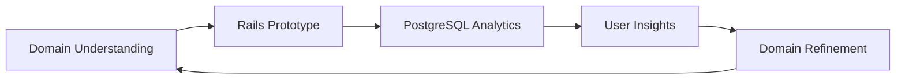

# The Entrepreneur's Secret Weapon: Full-Stack Domain Mastery

*Why understanding the complete technology stack gives you superpowers in the startup world*

---

**Published**: January 2026  
**Author**: Professor, UCF Computer Science  
**Reading Time**: 10 minutes  

---

## The Three-in-One Professional

Imagine walking into a startup accelerator pitch session. Most entrepreneurs fall into predictable categories:

- **The Visionary**: Great ideas, no technical skills, needs a technical co-founder
- **The Developer**: Can build anything, struggles with business strategy and user needs
- **The Business Analyst**: Understands requirements, can't validate technical feasibility

Then there's you—the **Full-Stack Domain Master**. You understand the business problem (domain modeling), can architect the solution (database design), and build the entire application (Rails development). You're not just one person—you're an entire founding team.

This is your competitive advantage, and it's more powerful than you might realize.

## The Validation Superpower

### Speed to Market = Competitive Advantage

When you master Domain-Driven Design, Rails, and PostgreSQL, you can move from idea to working prototype in days, not months. This speed isn't just convenient—it's strategically crucial.

**Real Example**: Drew Houston, founder of Dropbox, built the initial prototype himself. He didn't need to find a technical co-founder, negotiate equity splits, or explain his vision to developers. He could validate his idea immediately.

**Your advantage**: While other entrepreneurs are still looking for technical co-founders, you're already testing your MVP with real users.

### The Lean Startup Method in Practice

Eric Ries's "Lean Startup" methodology is built around rapid experimentation:

1. **Build** a minimum viable product
2. **Measure** user response
3. **Learn** from the data
4. **Iterate** quickly

This cycle is only possible when you can execute all three phases yourself. Here's how your skills enable each phase:



**Build Phase**: Your domain modeling skills help you identify the core features that matter. Your Rails knowledge lets you build them quickly.

**Measure Phase**: Your database skills let you design analytics from day one, capturing the metrics that matter.

**Learn Phase**: Your full-stack understanding helps you interpret both technical metrics and user behavior.

## The Communication Superpower

### Speaking Three Languages Fluently

In the startup world, you need to communicate with three distinct groups:

1. **Investors**: They want to understand market opportunity and scalability
2. **Customers**: They want solutions to their problems
3. **Technical Teams**: They want clear requirements and feasible architectures

Most entrepreneurs struggle with at least one of these conversations. You can excel at all three.

#### With Investors
```
Investor: "How do you know this will scale?"

Typical Entrepreneur: "We'll figure that out when we get there."

You: "Our domain model separates core entities from operational data. 
We're using PostgreSQL with proper indexing strategies, and our Rails 
architecture follows proven patterns from companies like GitHub and 
Shopify. Here's our database schema and scaling plan..."
```

#### With Customers
```
Customer: "Can your system handle our complex approval workflows?"

Typical Entrepreneur: "I'll need to check with my technical team."

You: "Let me show you how our domain model handles approval states. 
We can configure multi-step workflows with different approval rules 
for different entity types. Here's a quick prototype..."
```

#### With Technical Teams
```
Developer: "The requirements are unclear. What exactly do you want?"

Typical Entrepreneur: "Just build something that works."

You: "Here's the domain model with entity relationships, the database 
schema with constraints, and the Rails models with business logic. 
The acceptance criteria are in the tests..."
```

### The Trust Factor

When you can speak technical language fluently, several things happen:

1. **Investors trust your execution ability**: You're not just an "idea person"
2. **Customers trust your understanding**: You grasp their technical challenges
3. **Developers trust your leadership**: You understand what you're asking for
4. **Partners trust your competence**: You can evaluate technical proposals

This trust translates directly into business opportunities.

## The Cost Advantage

### Bootstrap vs. Fundraising

Most tech startups face a chicken-and-egg problem: they need money to hire developers, but they need a working product to raise money. This forces them into expensive fundraising cycles or technical co-founder searches.

You can bootstrap. Here's the math:

**Traditional Path**:
- Technical co-founder: 20-50% equity
- Development team: $150,000-$300,000/year
- Time to MVP: 6-12 months
- Fundraising required: $500,000-$1,000,000

**Your Path**:
- Technical co-founder: You (0% equity cost)
- Development team: You ($0 initial cost)
- Time to MVP: 2-8 weeks
- Fundraising required: $0-$50,000 (for hosting and marketing)

**The difference**: You can validate your idea and gain traction before you need external funding. This puts you in a much stronger negotiating position.

### The Iteration Advantage

When changes cost you time instead of money, you can afford to experiment:

- **A/B testing**: Build multiple versions to test hypotheses
- **Pivot quickly**: Respond to market feedback without renegotiating contracts
- **Feature experimentation**: Try bold ideas without budget approval
- **Customer customization**: Build specific features for key prospects

## Real-World Success Stories

### GitHub: The Developer's Platform

Tom Preston-Werner, Chris Wanstrath, and PJ Hyett built GitHub because they understood both the domain (version control workflows) and the technology (Rails, Git). They could:

- **Identify the real problem**: Git was powerful but hard to use collaboratively
- **Design the solution**: Web interface that made Git accessible
- **Build the platform**: Rails application with Git integration
- **Scale the business**: From side project to $7.5 billion acquisition

**Key insight**: They didn't just build a Git hosting service—they understood the domain of software collaboration and built a platform around it.

### Shopify: The E-commerce Empire

Tobias Lütke started Shopify because he wanted to sell snowboards online but couldn't find good e-commerce software. His full-stack skills let him:

- **Understand the domain**: E-commerce workflows, inventory management, payment processing
- **Build the solution**: Rails application with proper database design
- **Iterate rapidly**: Add features based on his own needs and customer feedback
- **Scale globally**: From personal project to platform serving millions of merchants

**Key insight**: Domain expertise (e-commerce) + technical skills (Rails) = billion-dollar platform.

### Basecamp: The Project Management Revolution

Jason Fried and David Heinemeier Hansson (creator of Rails) built Basecamp because they understood both project management domains and web development. This combination let them:

- **Simplify complexity**: Most project management tools were overcomplicated
- **Focus on workflows**: Design around how teams actually work
- **Build sustainably**: Profitable from day one, no external funding needed
- **Influence the industry**: Their approach influenced countless other tools

**Key insight**: When you understand both the problem domain and the solution technology, you can create products that feel inevitable.

## The Modern Landscape: Your Opportunities

### Emerging Domains Waiting for Full-Stack Masters

Today's most promising opportunities exist at the intersection of domain expertise and technical capability:

#### Healthcare Technology
- **Domain challenge**: Complex regulations, patient privacy, clinical workflows
- **Technical opportunity**: Modern web applications can dramatically improve user experience
- **Your advantage**: Understanding both HIPAA compliance and Rails security

#### Financial Technology
- **Domain challenge**: Regulatory compliance, complex financial instruments, real-time processing
- **Technical opportunity**: Traditional banking technology is decades behind
- **Your advantage**: Database design skills for financial data + Rails for user interfaces

#### Education Technology
- **Domain challenge**: Learning science, institutional requirements, diverse user needs
- **Technical opportunity**: Most educational software is poorly designed
- **Your advantage**: Understanding educational domains + modern development practices

#### Climate Technology
- **Domain challenge**: Environmental science, policy frameworks, measurement complexity
- **Technical opportunity**: Data collection and analysis platforms
- **Your advantage**: Database design for environmental data + Rails for stakeholder interfaces

### The AI Amplification Effect

Artificial Intelligence is changing the game, but not in the way most people think. AI doesn't replace the need for domain understanding—it amplifies it.

**Traditional view**: "AI will automate programming, so technical skills won't matter."

**Reality**: AI helps you build faster, but you still need to know what to build and why.

Your full-stack domain mastery becomes even more valuable because:

1. **AI needs good prompts**: Understanding domains helps you ask better questions
2. **AI needs validation**: You can quickly test AI-generated solutions
3. **AI needs integration**: You can incorporate AI features into complete applications
4. **AI needs data**: Your database skills help you design systems that feed AI effectively

## Building Your Entrepreneurial Toolkit

### The Technical Foundation

Master these core skills that translate directly to entrepreneurial advantage:

#### Domain Modeling Excellence
```ruby
# Not just code—business understanding
class SubscriptionService
  def initialize(customer, plan)
    @customer = customer
    @plan = plan
  end
  
  def can_upgrade?
    # Business logic that reflects real-world constraints
    @customer.payment_method.valid? && 
    @plan.allows_upgrade_from?(@customer.current_plan) &&
    !@customer.has_pending_cancellation?
  end
  
  def calculate_prorated_amount
    # Financial domain knowledge in code
    days_remaining = @customer.current_billing_period.days_remaining
    daily_rate_difference = (@plan.monthly_price - @customer.current_plan.monthly_price) / 30
    (daily_rate_difference * days_remaining).round(2)
  end
end
```

**Entrepreneurial value**: You can model complex business rules accurately, which means your software actually solves real problems.

#### Database Design for Analytics
```sql
-- Design for both operations and insights
CREATE TABLE user_actions (
    id BIGSERIAL PRIMARY KEY,
    user_id BIGINT NOT NULL REFERENCES users(id),
    action_type VARCHAR(50) NOT NULL,
    entity_type VARCHAR(50),
    entity_id BIGINT,
    metadata JSONB,
    created_at TIMESTAMP WITH TIME ZONE DEFAULT CURRENT_TIMESTAMP
);

-- Enable real-time business intelligence
CREATE INDEX idx_user_actions_analytics 
ON user_actions(action_type, created_at) 
WHERE created_at > CURRENT_DATE - INTERVAL '30 days';
```

**Entrepreneurial value**: You can measure what matters from day one, making data-driven decisions instead of guessing.

#### Rails for Rapid Prototyping
```ruby
# Build MVPs that can scale
class API::V1::BaseController < ApplicationController
  before_action :authenticate_user!
  before_action :track_api_usage
  
  private
  
  def track_api_usage
    # Built-in analytics for business intelligence
    UserAction.create!(
      user: current_user,
      action_type: 'api_call',
      entity_type: controller_name,
      metadata: {
        endpoint: action_name,
        ip_address: request.remote_ip,
        user_agent: request.user_agent
      }
    )
  end
end
```

**Entrepreneurial value**: You can build professional-grade APIs that provide the foundation for mobile apps, integrations, and partnerships.

### The Business Foundation

#### Customer Development Skills
- **Interview techniques**: Learn to validate assumptions through customer conversations
- **Problem identification**: Use domain modeling skills to understand customer workflows
- **Solution validation**: Build prototypes that test specific hypotheses

#### Financial Modeling
- **Unit economics**: Understand customer acquisition cost, lifetime value, churn
- **Pricing strategy**: Model different pricing approaches with database scenarios
- **Growth projections**: Use your analytical skills to build realistic forecasts

#### Market Analysis
- **Competitive research**: Analyze existing solutions from a technical perspective
- **Technology trends**: Understand how emerging technologies create opportunities
- **Regulatory landscape**: Factor compliance requirements into technical decisions

## Your Action Plan

### Phase 1: Build Your Foundation (Months 1-3)
1. **Master the course material**: DDD, Rails, PostgreSQL
2. **Build portfolio projects**: Demonstrate your full-stack capabilities
3. **Study successful startups**: Analyze their domain models and technical decisions
4. **Network strategically**: Connect with entrepreneurs, investors, and potential customers

### Phase 2: Identify Your Opportunity (Months 4-6)
1. **Choose a domain**: Pick an industry or problem area you're passionate about
2. **Become a domain expert**: Study the workflows, regulations, and pain points
3. **Validate the problem**: Interview potential customers to understand their needs
4. **Analyze the competition**: Understand what exists and what's missing

### Phase 3: Build and Validate (Months 7-12)
1. **Create your MVP**: Use your full-stack skills to build a working prototype
2. **Get early customers**: Find people willing to pay for your solution
3. **Iterate rapidly**: Use customer feedback to improve your product
4. **Measure everything**: Use your database skills to track key metrics

### Phase 4: Scale and Grow (Year 2+)
1. **Optimize for growth**: Use your technical skills to handle increasing load
2. **Build your team**: Hire people who complement your skills
3. **Raise funding**: Use your traction and technical credibility to attract investors
4. **Expand your market**: Apply your domain expertise to adjacent opportunities

## The Mindset Shift

### From Student to Entrepreneur

The biggest change isn't technical—it's mental. You need to shift from:

- **"How do I solve this assignment?"** to **"What problem should I solve?"**
- **"Is my code correct?"** to **"Does my solution create value?"**
- **"What grade will I get?"** to **"What will customers pay for?"**
- **"How do I pass the test?"** to **"How do I test my assumptions?"**

### From Employee to Owner

Traditional career advice focuses on getting hired. Entrepreneurial thinking focuses on creating value:

- **Employee mindset**: "What skills do employers want?"
- **Entrepreneur mindset**: "What problems can I solve profitably?"

- **Employee mindset**: "How do I advance in this company?"
- **Entrepreneur mindset**: "How do I build a company?"

- **Employee mindset**: "What's my salary potential?"
- **Entrepreneur mindset**: "What's my value creation potential?"

## The Risk-Reward Calculation

### Understanding the Real Risks

**Myth**: "Entrepreneurship is risky."
**Reality**: "Not having entrepreneurial skills is risky."

In today's economy:
- **Job security is declining**: Companies restructure constantly
- **Skill obsolescence is accelerating**: Technology changes rapidly
- **Geographic constraints are limiting**: Remote work is becoming standard
- **Salary growth is capped**: Employee compensation has limits

**Your full-stack domain mastery provides security through capability, not employment.**

### The Asymmetric Upside

When you can build complete solutions yourself:
- **Downside is limited**: Your time and minimal hosting costs
- **Upside is unlimited**: Successful platforms can scale globally
- **Learning compounds**: Each project makes you more capable
- **Network effects**: Success attracts opportunities

## The Bottom Line

Full-stack domain mastery isn't just a technical skill set—it's an entrepreneurial superpower. When you understand business domains, can design scalable databases, and build complete applications, you have the ability to:

1. **Validate ideas quickly** without external dependencies
2. **Communicate effectively** with all stakeholders
3. **Bootstrap efficiently** without expensive technical teams
4. **Iterate rapidly** based on market feedback
5. **Scale strategically** as opportunities grow

The question isn't whether you should develop entrepreneurial skills—it's whether you'll use the skills you're already learning to create your own opportunities or just help others create theirs.

**The choice is yours. The tools are in your hands. The time is now.**

---

## Your Next Steps

1. **Identify a problem** you've personally experienced
2. **Model the domain** using the techniques from this course
3. **Build a simple prototype** with Rails and PostgreSQL
4. **Find one person** willing to pay for your solution
5. **Iterate based on feedback** and measure everything

Remember: Every billion-dollar company started with someone who understood a problem and had the skills to build a solution.

That someone could be you.

---

## Discussion Questions

1. What problems in your daily life could be solved with a Rails application?
2. How would you validate a business idea before building the full solution?
3. What domain expertise do you have that could be combined with technical skills?
4. How do you balance the risk of entrepreneurship with the security of employment?

---

*Share your entrepreneurial ideas and get feedback from classmates in the course discussion forum. Remember: the best time to start building is now.*