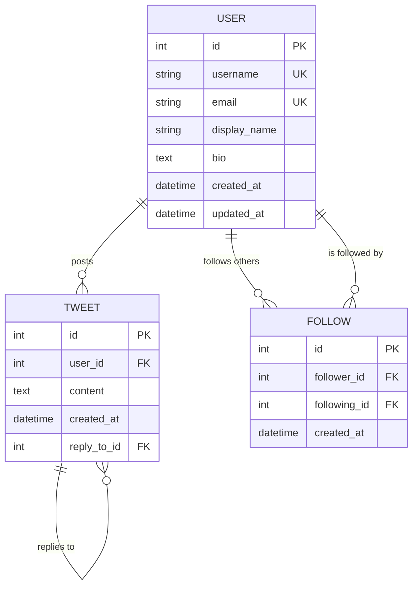

# From Dorm Room to Global Platform: The Twitter Story

*How a simple Rails application built on solid domain principles became one of the world's most influential platforms*

---

**Published**: January 2026  
**Author**: Professor, UCF Computer Science  
**Reading Time**: 8 minutes  

---

## The Power of Starting Simple

In 2006, a small team at a podcasting company called Odeo was struggling with their main product. During a company hackathon, software engineer Jack Dorsey pitched a simple idea: a platform where people could share short status updates with their friends. The concept was elegantly simple—140 characters, real-time updates, following relationships.

What happened next is one of the most remarkable stories in technology history. That simple idea, built initially as a Ruby on Rails application with a straightforward database design, would grow to become Twitter—a platform that would reshape global communication, influence elections, and create entirely new forms of social interaction.

**The lesson for you as a student**: Sometimes the most powerful applications start with the simplest domain models.

## The Domain-Driven Foundation

### Understanding the Core Domain

Twitter's early success wasn't just about the technology—it was about understanding the domain. The founders identified a fundamental human need: the desire to share thoughts and stay connected with others in real-time. This domain understanding drove every technical decision.

The core domain concepts were beautifully simple:



**What you can learn**: Great applications often start with just 3-4 core entities. Master the fundamentals before adding complexity.

### The Rails Advantage

Twitter's initial choice of Ruby on Rails wasn't accidental. Rails provided exactly what a startup needed:

1. **Rapid Prototyping**: The team could iterate quickly on features
2. **Convention over Configuration**: Less time spent on setup, more time on domain logic
3. **Active Record**: Simple, intuitive database interactions
4. **RESTful Design**: Clean API structure that would prove crucial for mobile apps
5. **Community**: Access to gems and community knowledge

Here's what the initial Rails models might have looked like:

```ruby
# app/models/user.rb
class User < ApplicationRecord
  validates :username, presence: true, uniqueness: true
  validates :email, presence: true, uniqueness: true
  
  has_many :tweets, dependent: :destroy
  has_many :follows_as_follower, class_name: 'Follow', 
           foreign_key: 'follower_id', dependent: :destroy
  has_many :follows_as_following, class_name: 'Follow', 
           foreign_key: 'following_id', dependent: :destroy
  
  has_many :following, through: :follows_as_follower, source: :following
  has_many :followers, through: :follows_as_following, source: :follower
  
  def timeline
    Tweet.where(user_id: following.pluck(:id) + [id])
         .order(created_at: :desc)
         .limit(50)
  end
end

# app/models/tweet.rb
class Tweet < ApplicationRecord
  belongs_to :user
  belongs_to :reply_to, class_name: 'Tweet', optional: true
  
  validates :content, presence: true, length: { maximum: 140 }
  
  scope :recent, -> { order(created_at: :desc) }
  scope :replies, -> { where.not(reply_to_id: nil) }
  scope :original, -> { where(reply_to_id: nil) }
  
  def replies
    Tweet.where(reply_to_id: id)
  end
end

# app/models/follow.rb
class Follow < ApplicationRecord
  belongs_to :follower, class_name: 'User'
  belongs_to :following, class_name: 'User'
  
  validates :follower_id, uniqueness: { scope: :following_id }
  validate :cannot_follow_self
  
  private
  
  def cannot_follow_self
    errors.add(:following_id, "can't follow yourself") if follower_id == following_id
  end
end
```

**What you can learn**: Clean, well-designed models with proper validations and relationships form the foundation of scalable applications.

## The Database Design That Scaled (Initially)

Twitter's early PostgreSQL database design was remarkably simple, yet it supported millions of users. The key was understanding the domain relationships and designing for the most common use cases.

```sql
-- Users table with essential information
CREATE TABLE users (
    id BIGSERIAL PRIMARY KEY,
    username VARCHAR(50) UNIQUE NOT NULL,
    email VARCHAR(255) UNIQUE NOT NULL,
    display_name VARCHAR(100),
    bio TEXT,
    created_at TIMESTAMP WITH TIME ZONE DEFAULT CURRENT_TIMESTAMP,
    updated_at TIMESTAMP WITH TIME ZONE DEFAULT CURRENT_TIMESTAMP
);

-- Tweets table optimized for timeline queries
CREATE TABLE tweets (
    id BIGSERIAL PRIMARY KEY,
    user_id BIGINT NOT NULL REFERENCES users(id),
    content TEXT NOT NULL CHECK (LENGTH(content) <= 140),
    reply_to_id BIGINT REFERENCES tweets(id),
    created_at TIMESTAMP WITH TIME ZONE DEFAULT CURRENT_TIMESTAMP
);

-- Follows table for social graph
CREATE TABLE follows (
    id BIGSERIAL PRIMARY KEY,
    follower_id BIGINT NOT NULL REFERENCES users(id),
    following_id BIGINT NOT NULL REFERENCES users(id),
    created_at TIMESTAMP WITH TIME ZONE DEFAULT CURRENT_TIMESTAMP,
    UNIQUE(follower_id, following_id),
    CHECK (follower_id != following_id)
);

-- Indexes for performance
CREATE INDEX idx_tweets_user_id_created_at ON tweets(user_id, created_at DESC);
CREATE INDEX idx_tweets_created_at ON tweets(created_at DESC);
CREATE INDEX idx_follows_follower_id ON follows(follower_id);
CREATE INDEX idx_follows_following_id ON follows(following_id);
```

**What you can learn**: Start with a simple, well-indexed database design. Premature optimization is the root of all evil, but thoughtful indexing from the beginning saves headaches later.

## The Scaling Journey: When Simple Becomes Complex

As Twitter grew from thousands to millions of users, the simple Rails application faced challenges that would teach the entire industry about scaling web applications.

### The Timeline Problem

The original timeline query was elegant but didn't scale:

```ruby
# This worked for thousands of users...
def timeline
  Tweet.where(user_id: following.pluck(:id) + [id])
       .order(created_at: :desc)
       .limit(50)
end

# But failed when users followed thousands of people
# and the platform had millions of tweets
```

### The Solution: Fan-out Architecture

Twitter evolved to a more sophisticated architecture, but the core domain concepts remained the same. They moved from a "pull" model (generate timeline on request) to a "push" model (pre-compute timelines).

```ruby
# Evolution: Pre-computed timelines
class TimelineService
  def self.add_tweet_to_followers(tweet)
    tweet.user.followers.find_each do |follower|
      TimelineEntry.create!(
        user_id: follower.id,
        tweet_id: tweet.id,
        created_at: tweet.created_at
      )
    end
  end
end
```

**What you can learn**: Your domain model can remain stable even as your architecture evolves. Good domain design is timeless.

## The Business Impact: From Idea to IPO

Twitter's journey from a Rails application to a public company valued at billions demonstrates the power of understanding both domains and technology:

### Key Milestones
- **2006**: Initial Rails prototype built in 2 weeks
- **2007**: Gained traction during SXSW conference
- **2008**: Scaled to handle election traffic
- **2010**: 100 million users
- **2013**: IPO at $26 billion valuation
- **2022**: Acquired for $44 billion

### The Full-Stack Advantage

The Twitter founders succeeded because they combined:

1. **Domain Understanding**: They grasped the social dynamics of communication
2. **Technical Execution**: Rails allowed rapid iteration and deployment
3. **Database Design**: Simple, scalable data models
4. **Business Acumen**: They understood the market opportunity

**This is exactly what you're learning in this course.**

## Lessons for Your Career

### 1. Start with the Domain, Not the Technology

Twitter succeeded because the founders understood the problem they were solving. The technology (Rails, PostgreSQL) was chosen to serve the domain, not the other way around.

**Your takeaway**: When you understand domains deeply, you can choose the right technology to solve real problems.

### 2. Simple Beats Complex (Initially)

Twitter's initial simplicity was a feature, not a bug. Three core entities (User, Tweet, Follow) were enough to create a billion-dollar platform.

**Your takeaway**: Master the fundamentals. Complex systems emerge from simple, well-designed foundations.

### 3. Full-Stack Skills Create Opportunities

The Twitter team could move from idea to working prototype quickly because they understood the complete stack: domain modeling, database design, application logic, and user interfaces.

**Your takeaway**: When you master DDD, Rails, and PostgreSQL, you can turn ideas into reality faster than teams of specialists.

### 4. Scale is a Good Problem to Have

Twitter's scaling challenges came from success, not failure. Their simple Rails application proved the concept and attracted users.

**Your takeaway**: Build for today's problems, not tomorrow's scale. Premature optimization kills more startups than scaling problems.

## The Modern Relevance

Today's most successful platforms still follow Twitter's playbook:

- **Instagram**: Started as a simple Rails app for photo sharing
- **GitHub**: Built on Rails with a clear domain model for code collaboration
- **Shopify**: Rails-based e-commerce platform serving millions of merchants
- **Basecamp**: The company that created Rails, still using it for project management

## Your Opportunity

You're learning the same skills that created Twitter:

1. **Domain-Driven Design**: Understanding business problems deeply
2. **Ruby on Rails**: Rapid application development
3. **PostgreSQL**: Scalable database design
4. **Full-Stack Thinking**: End-to-end solution development

### The Question Is: What Will You Build?

With these skills, you could create:
- The next social platform
- A revolutionary e-commerce solution
- A productivity tool that changes how people work
- A platform that solves problems you see in your daily life

## Action Steps for Students

### 1. Build Your Own "Twitter"
Create a simple social platform with:
- User registration and authentication
- Short message posting
- Following relationships
- Timeline generation

Start simple. Focus on the domain. Make it work before making it perfect.

### 2. Study the Evolution
Research how Twitter's architecture evolved:
- Read about their scaling challenges
- Understand their solutions
- Apply these lessons to your own projects

### 3. Think Like a Founder
Ask yourself:
- What problems do I see that need solving?
- How could a simple Rails application address these problems?
- What would the core domain entities be?

### 4. Build Your Portfolio
Create projects that demonstrate your full-stack capabilities:
- Clear domain modeling
- Clean Rails implementation
- Thoughtful database design
- User-focused interfaces

## The Bottom Line

Twitter's story proves that understanding domains, mastering Rails, and designing good databases isn't just academic—it's the foundation for creating applications that can change the world.

You're not just learning to code. You're learning to think like an entrepreneur, build like an engineer, and execute like a founder.

The next Twitter, Instagram, or revolutionary platform could come from someone sitting in your classroom right now. The question is: will it be you?

---

*"The best time to plant a tree was 20 years ago. The second best time is now." - Chinese Proverb*

*Start building your world-changing application today.*

---

## Further Reading

- [Twitter's Early Architecture](https://blog.twitter.com/engineering/en_us/topics/infrastructure/2017/the-infrastructure-behind-twitter-scale)
- [Rails at Scale: Lessons from Twitter](https://rubyonrails.org/doctrine/)
- [Domain-Driven Design in Practice](https://martinfowler.com/bliki/DomainDrivenDesign.html)
- [From Zero to IPO: The Twitter Story](https://www.businessinsider.com/twitter-history-2013-10)

## Discussion Questions

1. How might Twitter's story have been different if they had started with a more complex architecture?
2. What other simple domain models could become billion-dollar platforms?
3. How do you balance simplicity with scalability in your own projects?
4. What problems in your life could be solved with a simple Rails application?

---

*Share your thoughts and your own "simple idea that could change the world" in the course discussion forum.*