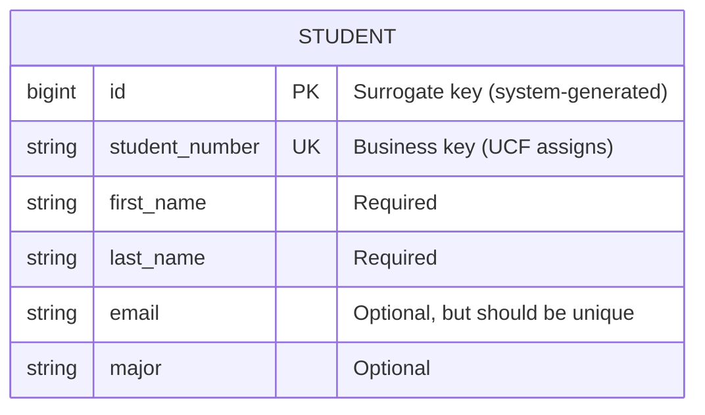
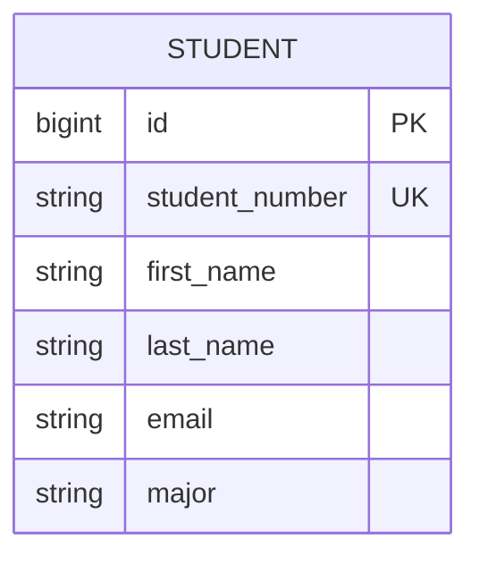

# Module 1: Thinking in Relations

Before writing a single line of code, we start where every good application begins: **understanding the data**.

This module introduces relational thinking—the foundation of database design that will guide every decision we make throughout this course. We'll use Ruby on Rails to bring our data model to life, but remember: **the database design comes first, the code follows**.

---

## The Relational Mindset

### Why Start with Data?

Every application is fundamentally about **storing, retrieving, and transforming data**. Before you choose a programming language, before you pick a framework, you should be able to answer:

- What **things** (entities) does this system track?
- What **attributes** describe each thing?
- How do these things **relate** to each other?

This is **relational thinking**—and it's the most transferable skill you'll learn. Languages and frameworks come and go, but relational databases have been the backbone of software for 50+ years.

### Our Domain: UCF Course Manager

We're building a course management system for UCF. Let's start by identifying our first entity:

**Student** - A person enrolled at UCF who takes courses.

What do we know about a student?

| Attribute | Description | Example |
|-----------|-------------|---------|
| student_number | Unique UCF identifier | "UCF001" |
| first_name | Given name | "Alice" |
| last_name | Family name | "Johnson" |
| email | Contact email | "alice@knights.ucf.edu" |
| major | Field of study | "Computer Science" |

---

## Entity-Relationship Diagram

Before touching code, we draw. Here's our first ERD using Mermaid:



### Reading the Diagram

| Symbol | Meaning |
|--------|---------|
| `PK` | Primary Key - unique identifier for each row |
| `UK` | Unique Key - another column that must be unique |
| `bigint`, `string` | Data types |

### Two Kinds of Identity

Notice we have two unique identifiers:

1. **`id`** (Surrogate Key) - A number the database generates automatically (1, 2, 3...). The system uses this internally.

2. **`student_number`** (Business Key) - A meaningful identifier from the real world ("UCF001"). Humans use this.

**Why both?** The business key (`student_number`) comes from UCF's registration system—we don't control it. The surrogate key (`id`) is ours to manage, making joins and foreign keys simpler.

---

## Logical Database Design

If we were to create this table in SQL, it would look like:

```sql
CREATE TABLE students (
    id BIGSERIAL PRIMARY KEY,
    student_number VARCHAR(20) NOT NULL UNIQUE,
    first_name VARCHAR(100) NOT NULL,
    last_name VARCHAR(100) NOT NULL,
    email VARCHAR(255),
    major VARCHAR(100),
    created_at TIMESTAMP DEFAULT CURRENT_TIMESTAMP,
    updated_at TIMESTAMP DEFAULT CURRENT_TIMESTAMP
);

CREATE UNIQUE INDEX idx_students_student_number ON students(student_number);
CREATE INDEX idx_students_email ON students(email);
```

### Design Decisions Explained

| Decision | Rationale |
|----------|-----------|
| `BIGSERIAL` for id | Auto-incrementing 64-bit integer. Handles billions of records. |
| `NOT NULL` on names | Business rule: every student must have a name |
| `UNIQUE` on student_number | No two students share the same UCF ID |
| Index on email | We'll likely search by email frequently |
| Timestamps | Track when records are created and modified |

**This is the destination.** In Module 2, we'll actually create this table. For now, we're previewing where we're headed.

---

## From Diagram to Code: The Rails Implementation

Now that we understand our data model, let's see how Rails represents it. Rails will be our tool for building the application around this database design.

### The Model Class

In Rails, a **Model** represents a database table. Here's our Student model:

```ruby
class Student
  attr_accessor :id, :student_number, :first_name, :last_name, :email, :major

  def full_name
    "#{first_name} #{last_name}"
  end
end
```

Each attribute in our ERD becomes an attribute in the Ruby class.

### Mapping: Database ↔ Ruby ↔ Java ↔ C

| ERD Attribute | SQL Column | Ruby | Java | C |
|---------------|------------|------|------|---|
| first_name | `VARCHAR(100)` | `attr_accessor :first_name` | `private String firstName;` | `char first_name[100];` |
| id | `BIGSERIAL` | `attr_accessor :id` | `private Long id;` | `long id;` |
| student_number | `VARCHAR(20)` | `attr_accessor :student_number` | `private String studentNumber;` | `char student_number[20];` |

The database schema is the source of truth. The code in any language is just a representation of that schema.

---

## Ruby Syntax for Java/C Developers

Since you're coming from Java or C, here's a quick translation guide:

### Class Definition

**Java:**
```java
public class Student {
    private String firstName;
    private String lastName;

    public Student(String firstName, String lastName) {
        this.firstName = firstName;
        this.lastName = lastName;
    }

    public String getFullName() {
        return firstName + " " + lastName;
    }
}
```

**Ruby:**
```ruby
class Student
  attr_accessor :first_name, :last_name

  def initialize(first_name:, last_name:)
    @first_name = first_name
    @last_name = last_name
  end

  def full_name
    "#{first_name} #{last_name}"
  end
end
```

### Key Differences

| Concept | Java/C | Ruby |
|---------|--------|------|
| Instance variables | `this.firstName` | `@first_name` |
| Getters/Setters | Write manually | `attr_accessor` generates them |
| String interpolation | `"Hello " + name` | `"Hello #{name}"` |
| No semicolons | Required | Not needed |
| No type declarations | `String name` | Just `name` |
| Constructor | Same as class name | Always `initialize` |

### For C Developers

Think of Ruby classes as structs with methods attached—but with automatic memory management:

**C:**
```c
typedef struct {
    long id;
    char student_number[20];
    char first_name[100];
    char last_name[100];
} Student;

// Must manually allocate, track, and free memory
Student* create_student() {
    Student* s = malloc(sizeof(Student));
    // ... initialize fields
    return s;
}
```

**Ruby:**
```ruby
class Student
  attr_accessor :id, :student_number, :first_name, :last_name
  # No malloc, no free, no memory leaks
end

student = Student.new(first_name: "Alice", last_name: "Johnson")
# Ruby handles memory automatically
```

---

## MVC Architecture: Separating Concerns

Rails organizes code using the **Model-View-Controller** pattern:

```
┌─────────────────────────────────────────────────────────────┐
│  Browser Request: GET /students                             │
└─────────────────────────────────────────────────────────────┘
                              │
                              ▼
┌─────────────────────────────────────────────────────────────┐
│  ROUTER (config/routes.rb)                                  │
│  "GET /students goes to StudentsController#index"           │
└─────────────────────────────────────────────────────────────┘
                              │
                              ▼
┌─────────────────────────────────────────────────────────────┐
│  CONTROLLER (app/controllers/students_controller.rb)        │
│  def index                                                  │
│    @students = Student.all  # ← Fetch from Model            │
│  end                                                        │
└─────────────────────────────────────────────────────────────┘
                              │
              ┌───────────────┴───────────────┐
              ▼                               ▼
┌──────────────────────────┐    ┌──────────────────────────┐
│  MODEL                   │    │  VIEW                    │
│  (app/models/student.rb) │    │  (app/views/students/    │
│                          │    │   index.html.erb)        │
│  Represents the          │    │                          │
│  STUDENTS table          │    │  Renders HTML using      │
│                          │    │  @students data          │
└──────────────────────────┘    └──────────────────────────┘
                                              │
                                              ▼
┌─────────────────────────────────────────────────────────────┐
│  Browser Response: HTML page with student list              │
└─────────────────────────────────────────────────────────────┘
```

### Why This Matters for Database Design

- **Model** = Your database tables. This is where relational design lives.
- **Controller** = Business logic that orchestrates queries
- **View** = Presentation only—no database logic here

The Model is the most important layer. Get the database design right, and the rest follows naturally.

---

## Running the Application

```bash
cd course/modules/01-rails-foundations/app
bundle install
bin/rails server
```

Open http://localhost:3000 to see the student list.

### Exploring in the Console

```bash
bin/rails console
```

```ruby
# See all students
Student.all

# Find a specific student
Student.find(1)

# Access attributes
s = Student.find(1)
s.first_name        # "Alice"
s.full_name         # "Alice Johnson"

# Filter students (like a WHERE clause)
Student.all.select { |s| s.major == "Computer Science" }
```

---

## Returning to the Database: What's Next?

In this module, we used **in-memory data**—students exist only while the server runs. This let us focus on Ruby syntax and Rails structure without database complexity.

But look back at our ERD:



In **Module 2**, we'll make this real:

1. Create an actual PostgreSQL database
2. Write a **migration** (Rails' version of `CREATE TABLE`)
3. See how `db/schema.rb` reflects our ERD
4. Query with SQL and Active Record

The in-memory Student class we built here will transform into a proper database-backed model. You'll see the exact SQL Rails generates and verify it matches our logical design.

---

## Key Takeaways

1. **Start with the data model.** Sketch the ERD before writing code.
2. **Identify entities and attributes.** What are you storing? What describes it?
3. **Distinguish surrogate keys from business keys.** Both have their place.
4. **The database is the foundation.** Rails (or any framework) is just a way to interact with it.
5. **Relational thinking is transferable.** This skill works with any language or framework.

---

## Exercises

### Exercise 1: Add an Attribute

Add `enrollment_date` to the Student entity:

1. Update the ERD diagram above—what type should it be?
2. Add it to `app/models/student.rb`
3. Update the seed data
4. Display it in the view

Think: What SQL type would this be? (`DATE`, `TIMESTAMP`?)

### Exercise 2: Design a New Entity

Without writing code, design a **Course** entity:

1. What attributes would it have?
2. What's the business key? (Hint: course codes like "COP3502")
3. Draw the ERD using Mermaid syntax
4. What constraints would you add?

We'll implement this in Module 3.

### Exercise 3: Console Exploration

```ruby
# In bin/rails console

# Count students
Student.count

# Find by attribute (preview of database queries)
Student.all.find { |s| s.student_number == "UCF001" }

# Map to get just names (like SELECT first_name FROM students)
Student.all.map { |s| s.first_name }
```

---

## Glossary

| Term | Definition |
|------|------------|
| **Entity** | A thing in your domain that has identity (Student, Course) |
| **Attribute** | A property of an entity (first_name, email) |
| **Primary Key (PK)** | Unique identifier for each row in a table |
| **Surrogate Key** | System-generated identifier (auto-increment id) |
| **Business Key** | Domain-meaningful unique identifier (student_number) |
| **ERD** | Entity-Relationship Diagram—visual representation of data model |
| **Model** | Rails class representing a database table |
| **MVC** | Model-View-Controller architecture pattern |

---

## Resources

- [Mermaid ERD Syntax](https://mermaid.js.org/syntax/entityRelationshipDiagram.html)
- [PostgreSQL Data Types](https://www.postgresql.org/docs/current/datatype.html)
- [Ruby in Twenty Minutes](https://www.ruby-lang.org/en/documentation/quickstart/)
- [Rails Getting Started Guide](https://guides.rubyonrails.org/getting_started.html)
