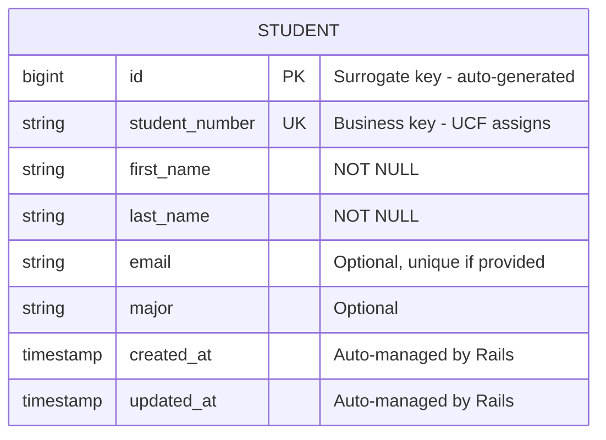
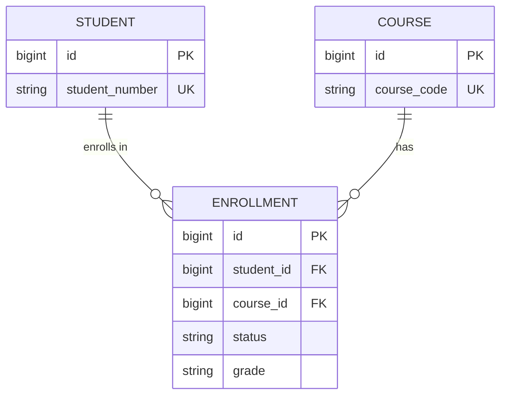

# UCF Course Manager - Domain Model (Module 1)

## Single Entity: Student

This ERD represents our starting point—a single entity with no relationships yet.



## Entity Analysis

### Identity

| Key Type | Column | Purpose |
|----------|--------|---------|
| **Primary Key (PK)** | `id` | System-generated, used for internal references and foreign keys |
| **Business Key (UK)** | `student_number` | Human-readable identifier from UCF's system |

### Attributes

| Attribute | Type | Constraints | Rationale |
|-----------|------|-------------|-----------|
| `id` | BIGINT | PRIMARY KEY, AUTO INCREMENT | Standard surrogate key |
| `student_number` | VARCHAR(20) | NOT NULL, UNIQUE | UCF's identifier, must be unique |
| `first_name` | VARCHAR(100) | NOT NULL | Required for identification |
| `last_name` | VARCHAR(100) | NOT NULL | Required for identification |
| `email` | VARCHAR(255) | UNIQUE (if not null) | Contact info, unique per student |
| `major` | VARCHAR(100) | nullable | May be undeclared |
| `created_at` | TIMESTAMP | NOT NULL, DEFAULT NOW | Audit trail |
| `updated_at` | TIMESTAMP | NOT NULL, DEFAULT NOW | Audit trail |

## Logical SQL Schema

```sql
CREATE TABLE students (
    id BIGSERIAL PRIMARY KEY,
    student_number VARCHAR(20) NOT NULL,
    first_name VARCHAR(100) NOT NULL,
    last_name VARCHAR(100) NOT NULL,
    email VARCHAR(255),
    major VARCHAR(100),
    created_at TIMESTAMP NOT NULL DEFAULT CURRENT_TIMESTAMP,
    updated_at TIMESTAMP NOT NULL DEFAULT CURRENT_TIMESTAMP,

    CONSTRAINT uk_students_student_number UNIQUE (student_number),
    CONSTRAINT uk_students_email UNIQUE (email)
);

-- Indexes for common queries
CREATE INDEX idx_students_last_name ON students(last_name);
CREATE INDEX idx_students_major ON students(major);
```

## Design Decisions

### Why Two Unique Keys?

1. **Surrogate Key (`id`)**:
   - Simple integer, efficient for joins
   - Never changes, even if student_number policy changes
   - Used for all foreign key references

2. **Business Key (`student_number`)**:
   - Meaningful to users ("UCF001")
   - Used in URLs, reports, and user interfaces
   - May come from external system (UCF's registration)

### Why Separate Names?

Storing `first_name` and `last_name` separately allows:
- Sorting by last name (common requirement)
- Formal addressing ("Dear Mr. Johnson")
- Partial searches ("all students named Alice")

A single `full_name` field would require parsing—error-prone and inflexible.

### Nullable vs Required

| Required (NOT NULL) | Optional (Nullable) |
|---------------------|---------------------|
| student_number | email |
| first_name | major |
| last_name | |

- Required fields are essential for the entity to exist
- Optional fields can be filled in later

## What's Missing (Future Modules)

This entity exists in isolation. In upcoming modules:

- **Module 3**: Add `Course` entity (another independent entity)
- **Module 4**: Add `Enrollment` to connect Students and Courses (relationship)
- **Module 5**: Add composite attributes (Address, PersonName as descriptors)



*Preview of Module 4's ERD*

---

## Rails Implementation Notes

In Module 1, we use an in-memory Ruby class (no database yet):

```ruby
class Student
  attr_accessor :id, :student_number, :first_name, :last_name, :email, :major
end
```

In Module 2, this becomes a proper Active Record model backed by PostgreSQL:

```ruby
class Student < ApplicationRecord
  validates :student_number, presence: true, uniqueness: true
  validates :first_name, presence: true
  validates :last_name, presence: true
end
```

The ERD drives the implementation—not the other way around.

---

*This artifact is version-controlled alongside the code. As the domain model evolves, we update this diagram.*
