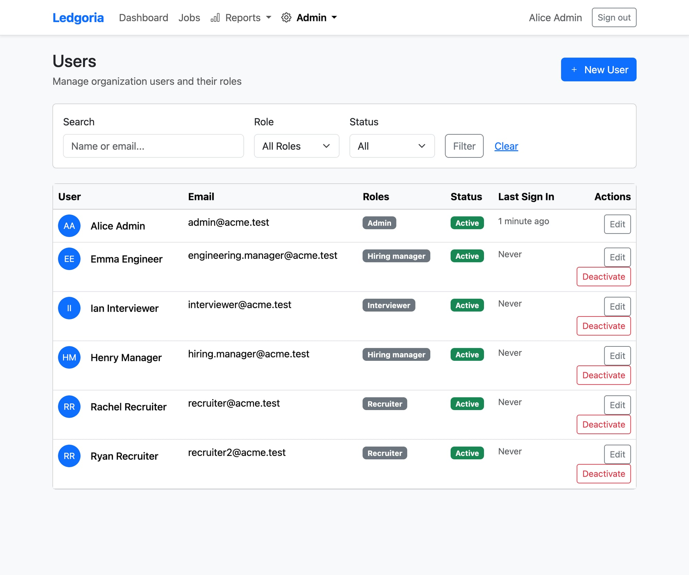
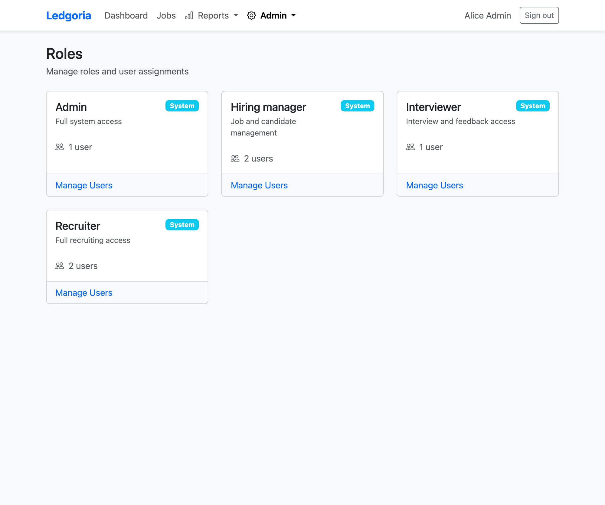
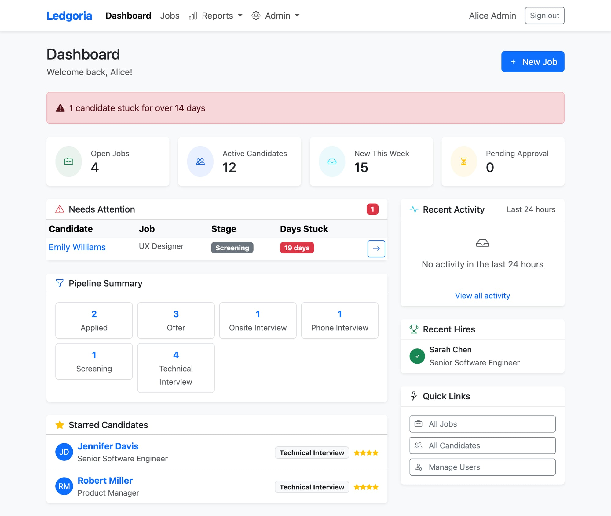
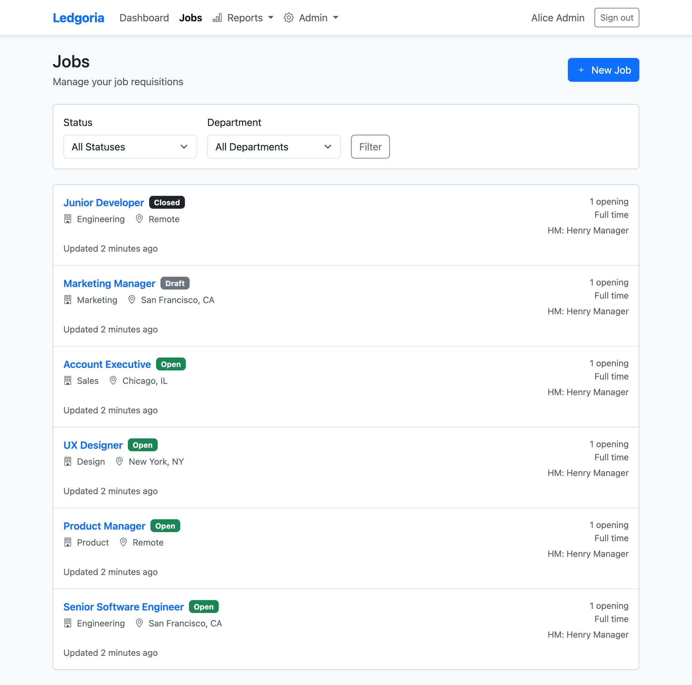
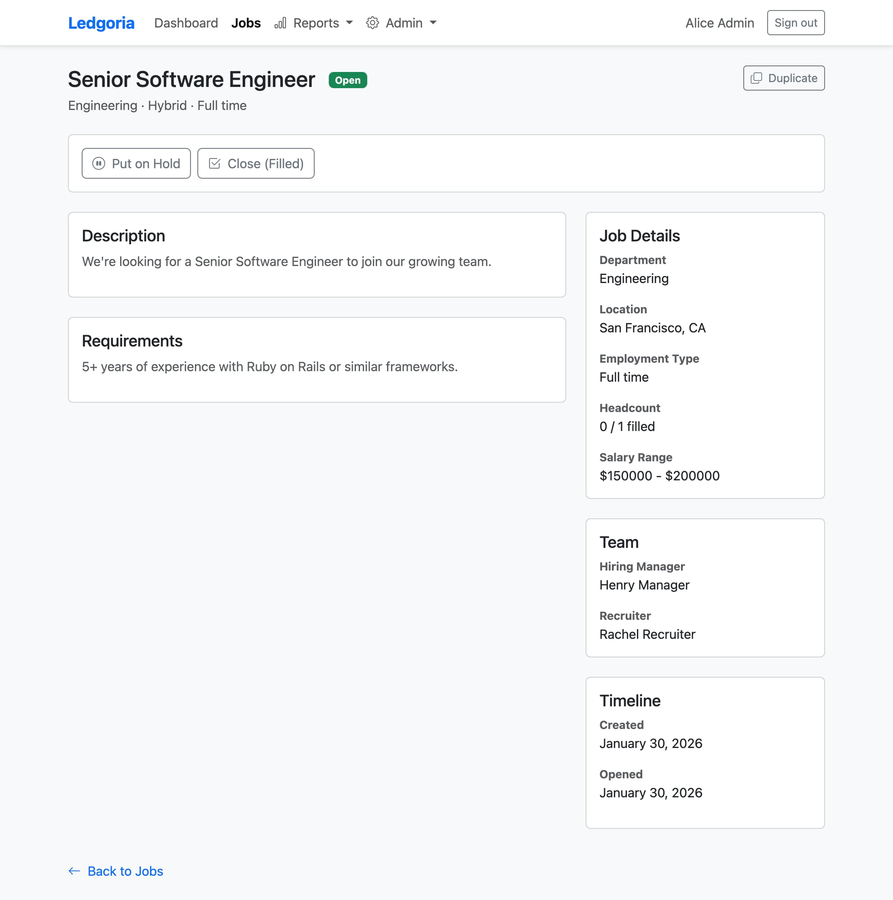
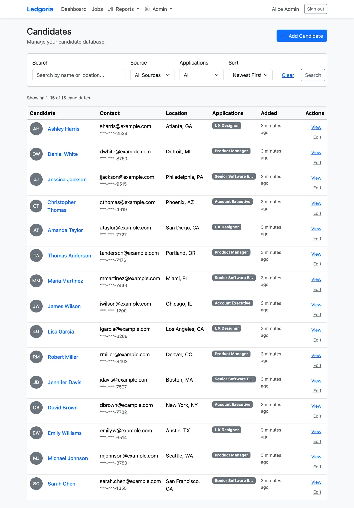
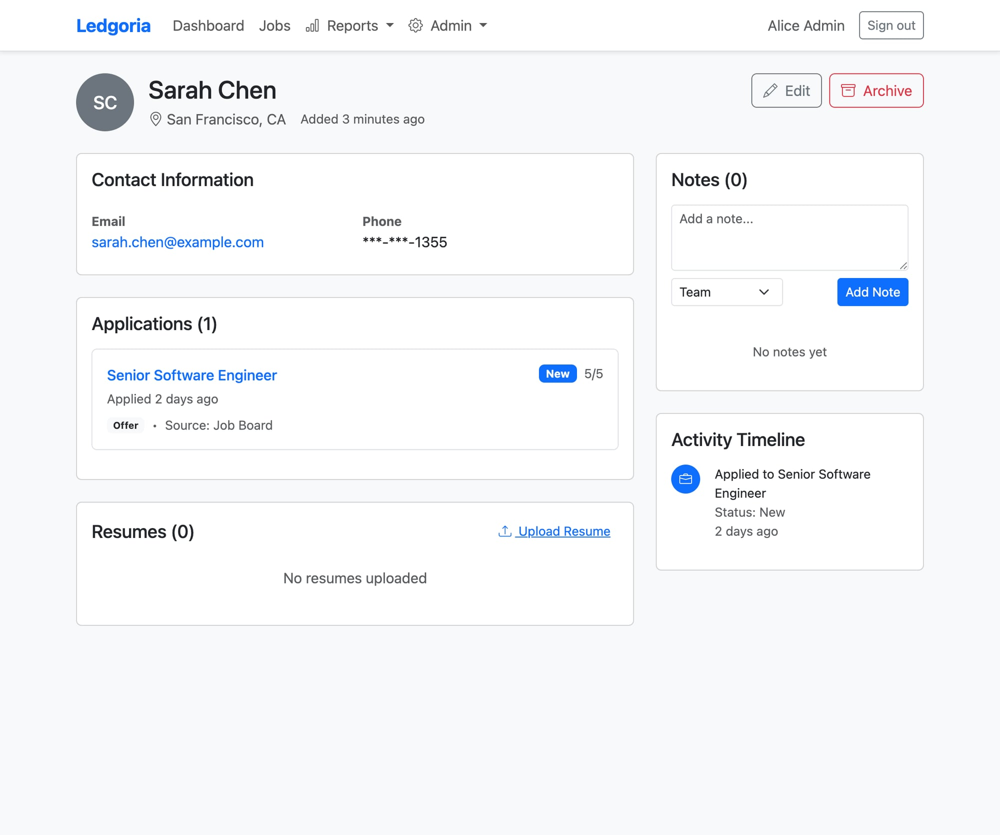
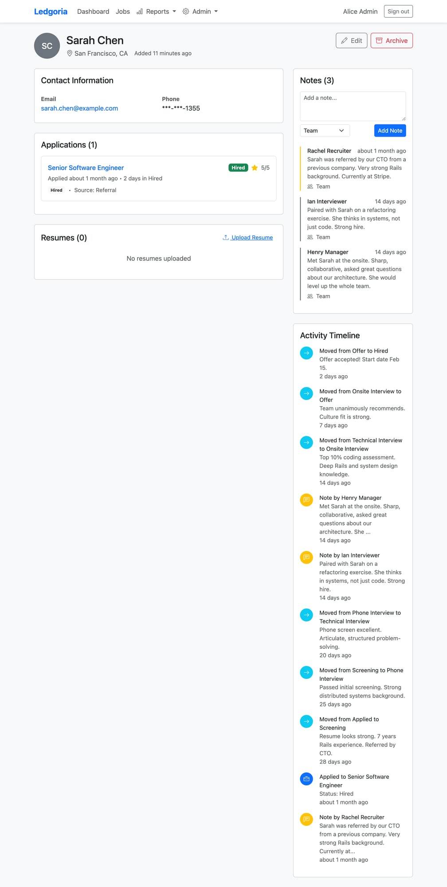

# Module 2 (Supplementary): ER Modeling, SQL & the Application That Lives On Top

**Lesson Date:** Saturday, February 1, 2026  
**Duration:** ~90 minutes  
**Case Study:** Legoria — an Applicant Tracking System (ATS)

---

## What This Lesson Is About

You know SQL. You can write a SELECT, a JOIN, a GROUP BY. But have you ever looked at an application — like LinkedIn or Workday — and thought: *"What's the data model underneath this?"*

That's what today is about. We're going to take a real ATS called **Legoria** and walk between three views of the same truth:

1. **ER Diagram** — the shape of the data
2. **SQL** — how you ask questions of it
3. **GUI** — how users interact with it

Every screen you see in a web app is a query. Every form field is a column. Every dropdown is a foreign key. Every list is a `SELECT` with `JOIN`s. Once you see this, you can't unsee it.

We'll cover two domains:
- **Part 1: RBAC** — Role-Based Access Control (Who can do what?)
- **Part 2: Job → Applicant Pipeline** — The core hiring workflow
- **Part 3: The Bridge Moment** — Connecting ER → SQL → GUI → API
- **Part 4: Challenge Query** — Tying both domains together

> 📋 **Setup:** Before you start, see [INSTRUCTIONS.md](./INSTRUCTIONS.md) for how to connect.  
> 📎 **Quick ref:** Keep [cheat-sheet.md](./cheat-sheet.md) open in a second tab.

---

## Part 1: RBAC — Who Can Do What? (~30 min)

### The Big Picture

Every real application has to answer one question over and over: **"Is this user allowed to do this thing?"** That's access control. Legoria uses RBAC — Role-Based Access Control — which means permissions aren't assigned directly to users. Instead:

- Users get **roles** (like "Recruiter" or "Admin")
- Roles get **permissions** (like "can read candidates" or "can delete jobs")
- To check if a user can do something, you follow the chain: User → Role → Permission

This is a classic pattern you'll see everywhere — AWS IAM, GitHub organizations, any SaaS product.

### The ER Shape

```
┌──────────────┐     ┌──────────────┐     ┌──────────────────┐     ┌───────────────┐
│    users     │     │  user_roles  │     │      roles       │     │role_permissions│
├──────────────┤     ├──────────────┤     ├──────────────────┤     ├───────────────┤
│ id           │────<│ user_id      │>────│ id               │────<│ role_id       │
│ org_id       │     │ role_id      │     │ organization_id  │     │ permission_id │
│ email        │     │ granted_at   │     │ name             │     │ conditions    │
│ first_name   │     │ granted_by_id│     │ description      │     └───────┬───────┘
│ last_name    │     └──────────────┘     │ system_role      │             │
│ active       │                          └──────────────────┘             │
└──────────────┘                                                   ┌──────┴───────┐
                                                                   │ permissions  │
                                                                   ├──────────────┤
                                                                   │ id           │
                                                                   │ resource     │
                                                                   │ action       │
                                                                   │ description  │
                                                                   └──────────────┘
```

> 🔗 See the full Mermaid ERD: [artifacts/erd/rbac-model.md](./artifacts/erd/rbac-model.md)

### Teaching Points — What to Notice

1. **Two join tables in one pattern.** `user_roles` connects users to roles. `role_permissions` connects roles to permissions. Same pattern, twice. The user is two JOINs away from their permissions.

2. **Join tables aren't always just two FKs.** Look at `user_roles` — it has `granted_at` and `granted_by_id`. That's **audit data on the relationship itself**. When was this role given? Who gave it? That's not about the user or the role — it's about the *assignment*.

3. **Permissions are resource + action pairs.** The `permissions` table doesn't say "can do stuff." It says `resource = 'candidates'` and `action = 'read'`. That's the atomic unit of access. Think of it like a Unix permission: the resource is the file, the action is read/write/execute.

4. **Everything is scoped to `organization_id`.** This is **multi-tenant design**. Acme Corp's roles can't see Globex Corp's data. One database, many organizations, all isolated by that FK.

### See It in the GUI


> **Screenshot: Users Admin Page.** See the Roles column? Those badges ("Admin", "Recruiter") are the `user_roles` join table rendered visually. Each badge = one row in `user_roles`. The GUI is literally showing you the JOIN result.


> **Screenshot: Roles Page.** Four system roles, each showing a user count. Behind each card: `role_permissions` rows linking that role to specific `permissions`. Click one and you'd see the permission list — that's `role_permissions JOIN permissions`.

### SQL Exercises

Open your SQLite console and try these. Each one teaches a different concept.

```sql
-- Exercise 1: What roles does Alice Admin have?
-- CONCEPT: Basic 3-table JOIN chain (user → user_roles → roles)
-- WHY IT MATTERS: This is the fundamental RBAC lookup
SELECT u.first_name, u.last_name, r.name AS role_name, ur.granted_at
FROM users u
JOIN user_roles ur ON ur.user_id = u.id
JOIN roles r ON r.id = ur.role_id
WHERE u.email = 'admin@acme.test';
```

```sql
-- Exercise 2: What can the Recruiter role do?
-- CONCEPT: Walking the other side of the chain (role → role_permissions → permissions)
-- WHY IT MATTERS: Shows how granular permissions are (resource + action)
SELECT r.name AS role, p.resource, p.action, p.description
FROM roles r
JOIN role_permissions rp ON rp.role_id = r.id
JOIN permissions p ON p.id = rp.permission_id
WHERE r.name = 'recruiter'
ORDER BY p.resource, p.action;
```

```sql
-- Exercise 3: THE BIG ONE — Can Ian Interviewer edit candidates?
-- CONCEPT: Full RBAC chain with LEFT JOIN (user → role → permission check)
-- WHY IT MATTERS: This is what the application does on EVERY page load
SELECT u.first_name, p.resource, p.action,
       CASE WHEN p.id IS NOT NULL THEN 'YES' ELSE 'NO' END AS has_access
FROM users u
JOIN user_roles ur ON ur.user_id = u.id
JOIN roles r ON r.id = ur.role_id
LEFT JOIN role_permissions rp ON rp.role_id = r.id
LEFT JOIN permissions p ON p.id = rp.permission_id
  AND p.resource = 'candidates' AND p.action = 'update'
WHERE u.email = 'interviewer@acme.test';
```

> 💡 **Notice the LEFT JOIN.** If Ian doesn't have the permission, we still get a row back — but `p.id` is NULL. That's how you check for the *absence* of something in SQL. An INNER JOIN would return nothing, and you couldn't tell the difference between "no permission" and "user doesn't exist."

```sql
-- Exercise 4: Compare permissions across roles
-- CONCEPT: GROUP BY with COUNT on a join table
-- WHY IT MATTERS: Quick audit — which role is most powerful?
SELECT r.name AS role, COUNT(rp.id) AS permission_count
FROM roles r
LEFT JOIN role_permissions rp ON rp.role_id = r.id
GROUP BY r.name
ORDER BY permission_count DESC;
```

### The Bridge: ER → SQL → GUI → API

Let's connect all four views of the same data:

| View | What It Looks Like |
|------|-------------------|
| **ER** | `users` ←→ `roles` through `user_roles` (many-to-many with audit columns) |
| **SQL** | `SELECT ... FROM users JOIN user_roles JOIN roles` — the 3-table chain |
| **GUI** | The Users page with role badges, the Roles page with permission cards |
| **API** | `GET /api/v1/users/:id` returns `{ roles: [{ name: "admin", permissions: [...] }] }` |
| **Form** | Edit User page has a role dropdown — that's a FK rendered as a `<select>` element |

---

## Part 2: Job → Applicant Pipeline (~30 min)

### The Big Picture

This is the core of an ATS: companies post **jobs**, **candidates** apply, and their **applications** move through a pipeline (screening → interview → offer → hired). It's a classic master-detail pattern with a twist — the application entity has its own lifecycle.

### The ER Shape

```
┌──────────────┐     ┌──────────────┐     ┌──────────────┐
│organizations │     │    jobs      │     │  candidates   │
├──────────────┤     ├──────────────┤     ├──────────────┤
│ id           │────<│ id           │     │ id            │
│ name         │     │ org_id       │     │ org_id        │
│ subdomain    │     │ department_id│     │ first_name    │
└──────────────┘     │ title        │     │ last_name     │
                     │ status       │     │ email         │
                     │ hiring_mgr_id│──>users              │
                     │ recruiter_id │──>users              │
                     └──────┬───────┘     └───────┬───────┘
                            │                     │
                     ┌──────┴──────────────────────┴──────┐
                     │          applications              │
                     ├────────────────────────────────────┤
                     │ id                                 │
                     │ organization_id                    │
                     │ job_id ──────────────> jobs        │
                     │ candidate_id ────────> candidates  │
                     │ current_stage_id ────> stages      │
                     │ status (state machine)             │
                     │ source_type                        │
                     │ applied_at                         │
                     │ hired_at / rejected_at             │
                     └────────────────────────────────────┘
```

> 🔗 See the full Mermaid ERD: [artifacts/erd/pipeline-model.md](./artifacts/erd/pipeline-model.md)

### Teaching Points — What to Notice

1. **Master-detail chain:** `organizations` → `jobs` → `applications`. An org has many jobs, a job has many applications. Classic hierarchical data.

2. **`applications` is a join entity, not a join table.** It sits between `jobs` and `candidates` — but it's not just two foreign keys. It has its own lifecycle (`status`), its own timestamps (`applied_at`, `hired_at`), its own attributes (`source_type`, `rating`). When a join table grows its own identity, we call it a **join entity** or **associative entity**. That's a key modeling concept.

3. **Two FKs to the same table.** Look at `jobs`: both `hiring_manager_id` and `recruiter_id` point to `users`. Same table, different relationships. In SQL, you'd alias the joins: `JOIN users AS hm ON ...` and `JOIN users AS r ON ...`. This is super common in real systems.

4. **State machine on `status`.** Applications don't just exist — they move through states: `new → screening → interviewing → offer → hired` (or `rejected`/`withdrawn` at any point). The `status` column IS the state machine. The `current_stage_id` FK points to the `stages` table for the pipeline position.

5. **Temporal columns.** `applied_at`, `hired_at`, `rejected_at` — these model *when things happened*. Not just "is this person hired?" but "when were they hired?" Time is data.

### See It in the GUI


> **Screenshot: Dashboard.** This is where everything starts. The Pipeline Summary shows the distribution of applications across stages. Under the hood, this is a `GROUP BY stages.name` with a `COUNT`. Every stat on this page is a SQL aggregate.


> **Screenshot: Jobs List.** Each row is a record in the `jobs` table. Status badges (Open/Draft/Closed), department, location — all columns. The filter dropdowns at the top map directly to `WHERE` clauses. When you select "Open" from the status filter, the app adds `WHERE status = 'open'` to the query.


> **Screenshot: Job Detail.** Click into a job and you see a single record from `jobs`. Title, description, requirements — all columns. The Team section shows `hiring_manager_id` and `recruiter_id` resolved to user names via JOIN. Salary range is two columns: `salary_min` and `salary_max`.


> **Screenshot: Candidates List.** Each row is a record in `candidates`. The Applications column shows which job they applied to — that's the `applications` join table rendered inline. Notice phone numbers are masked (***-***-1355) — the DB stores `encrypted_phone`. PII protection at the column level.


> **Screenshot: Sarah Chen's Profile.** Contact info from `candidates`. The Applications section shows her application to Senior Software Engineer with status and current stage. The Activity Timeline is built from `stage_transitions` and audit logs — every row in that timeline is a record somewhere.


> **Screenshot: Sarah Chen's Full Story.** This is the complete view — every piece of data about one candidate, pulled from multiple tables via JOINs. This single page touches `candidates`, `applications`, `jobs`, `stages`, `stage_transitions`, and more.

### SQL Exercises

```sql
-- Exercise 1: List all open jobs with their applicant count
-- CONCEPT: LEFT JOIN + GROUP BY + COUNT — the bread and butter of list pages
-- WHY IT MATTERS: This is exactly what the Jobs list page runs
SELECT j.title, j.status, j.location, COUNT(a.id) AS applicants
FROM jobs j
LEFT JOIN applications a ON a.job_id = j.id
WHERE j.status = 'open'
GROUP BY j.id, j.title, j.status, j.location
ORDER BY applicants DESC;
```

```sql
-- Exercise 2: Who applied to Senior Software Engineer and what stage are they in?
-- CONCEPT: 4-table JOIN chain (applications → candidates + stages + jobs)
-- WHY IT MATTERS: This is what the Job Detail "applicants" tab shows
SELECT c.first_name, c.last_name, c.email,
       s.name AS current_stage, a.status, a.applied_at
FROM applications a
JOIN candidates c ON c.id = a.candidate_id
JOIN stages s ON s.id = a.current_stage_id
JOIN jobs j ON j.id = a.job_id
WHERE j.title = 'Senior Software Engineer'
ORDER BY a.applied_at;
```

```sql
-- Exercise 3: Show the pipeline distribution (what the dashboard shows!)
-- CONCEPT: GROUP BY on a joined column with ORDER BY position
-- WHY IT MATTERS: This is literally the dashboard widget. You're writing the query behind the chart.
SELECT s.name AS stage, COUNT(a.id) AS count
FROM applications a
JOIN stages s ON s.id = a.current_stage_id
WHERE a.status NOT IN ('hired', 'rejected', 'withdrawn')
GROUP BY s.name
ORDER BY s.position;
```

```sql
-- Exercise 4: Which hiring manager has the most open jobs?
-- CONCEPT: JOIN to the same table (users) via a specific FK + aggregate
-- WHY IT MATTERS: Shows the two-FK-to-same-table pattern in action
SELECT u.first_name || ' ' || u.last_name AS hiring_manager,
       COUNT(j.id) AS open_jobs
FROM jobs j
JOIN users u ON u.id = j.hiring_manager_id
WHERE j.status = 'open'
GROUP BY u.id, u.first_name, u.last_name;
```

---

## Part 3: The Bridge Moment (~15 min)

Let's pick **`applications`** — the richest entity in the system — and see it through all four lenses at once.

| View | What It Looks Like |
|------|-------------------|
| **ER** | `applications` sits between `jobs` and `candidates`, with FKs to both plus `stages` |
| **SQL** | `SELECT ... FROM applications JOIN candidates JOIN jobs JOIN stages` |
| **API** | `GET /api/v1/jobs/:id/applications` returns JSON with nested candidate and stage |
| **Form** | The candidate detail page shows applications as cards with stage badges and source info |

### The Key Insight

> **The data model IS the application.** Everything you see on screen is a query. Every form field is a column. Every dropdown is a foreign key to a lookup table. Every list is a SELECT with JOINs.

This is why ER modeling matters. When you design the data model well, the application almost writes itself. When you design it badly, every feature is a fight against the schema.

Think about it:
- The **Dashboard** is `GROUP BY` + `COUNT`
- The **Jobs list** is `SELECT * FROM jobs WHERE ...`
- The **Job detail** is `SELECT ... FROM jobs JOIN users` (resolving the hiring manager FK)
- The **Candidates list** is `SELECT ... FROM candidates LEFT JOIN applications`
- The **Candidate profile** is `SELECT ... FROM candidates JOIN applications JOIN jobs JOIN stages`

Every. Single. Page. Is. A. Query.

---

## Part 4: Challenge Query (~15 min)

Now let's tie both domains together. This is the real-world question:

> **"Can recruiter Rachel see all applications for jobs she's assigned to?"**

This requires traversing **both** the RBAC model (does she have permission?) **and** the pipeline model (which jobs is she on?). Two data model segments, one business question.

### Step 1: Does Rachel have the permission?

```sql
-- Check RBAC: Does Rachel have 'applications.read'?
-- CONCEPT: Full RBAC chain traversal
SELECT p.resource, p.action
FROM users u
JOIN user_roles ur ON ur.user_id = u.id
JOIN role_permissions rp ON rp.role_id = ur.role_id
JOIN permissions p ON p.id = rp.permission_id
WHERE u.email = 'recruiter@acme.test'
  AND p.resource = 'applications' AND p.action = 'read';
```

> If this returns a row, she has permission. If empty, she's blocked at the door.

### Step 2: Which jobs is she recruiter for?

```sql
-- Check pipeline: Which jobs have Rachel as recruiter?
-- CONCEPT: FK relationship — jobs.recruiter_id → users.id
SELECT j.title
FROM jobs j
JOIN users u ON u.id = j.recruiter_id
WHERE u.email = 'recruiter@acme.test';
```

### Step 3: Full picture — her jobs with their applicants

```sql
-- The complete query: Rachel's assigned jobs + their applicants + pipeline stage
-- CONCEPT: This is what the application actually runs (after the RBAC check passes)
SELECT j.title, c.first_name || ' ' || c.last_name AS candidate,
       s.name AS stage, a.status
FROM applications a
JOIN jobs j ON j.id = a.job_id
JOIN candidates c ON c.id = a.candidate_id
JOIN stages s ON s.id = a.current_stage_id
WHERE j.recruiter_id = (SELECT id FROM users WHERE email = 'recruiter@acme.test')
ORDER BY j.title, s.position;
```

### The Discussion

In a real application, the code does this in two steps:
1. **RBAC check** — Can Rachel read applications *at all*? (Step 1)
2. **Scope the query** — Only show her the jobs she's assigned to (Step 3)

Two data model segments working together. The RBAC model says "you're allowed." The pipeline model says "here's what you can see." Neither works alone.

This is what real software architecture looks like — not one giant table, but interconnected models that each handle one concern.

---

## What We Learned

1. **ER diagrams are blueprints.** They show you the shape of the data before you write a single query.
2. **Join tables vs. join entities.** `user_roles` is a join table (mostly just FKs). `applications` is a join entity (has its own lifecycle and attributes). The difference matters.
3. **Every GUI element maps to a data concept.** Badges = join tables. Dropdowns = FK lookups. Lists = SELECT queries. Forms = INSERT/UPDATE.
4. **RBAC is a pattern, not a product.** Users → Roles → Permissions. Two join tables. You'll see this in every enterprise app you ever work on.
5. **State machines live in columns.** The `status` field on `applications` is a state machine. The database enforces which states are valid.

---

## Next Steps

- Try the [bonus exercises](./exercises/04-bonus-exploration.sql) if you want to go deeper
- Look at the [combined ERD](./artifacts/erd/combined-model.md) to see how everything connects
- Think about: what would you add to this schema? (Interviews table? Email templates? Scorecards?)

---

## Files in This Module

| File | What It Is |
|------|-----------|
| [INSTRUCTIONS.md](./INSTRUCTIONS.md) | Setup guide — how to connect |
| [cheat-sheet.md](./cheat-sheet.md) | Quick reference card |
| [exercises/01-rbac-queries.sql](./exercises/01-rbac-queries.sql) | RBAC SQL exercises |
| [exercises/02-pipeline-queries.sql](./exercises/02-pipeline-queries.sql) | Pipeline SQL exercises |
| [exercises/03-challenge-query.sql](./exercises/03-challenge-query.sql) | Combined challenge query |
| [exercises/04-bonus-exploration.sql](./exercises/04-bonus-exploration.sql) | Bonus exercises |
| [artifacts/erd/rbac-model.md](./artifacts/erd/rbac-model.md) | RBAC Mermaid ERD |
| [artifacts/erd/pipeline-model.md](./artifacts/erd/pipeline-model.md) | Pipeline Mermaid ERD |
| [artifacts/erd/combined-model.md](./artifacts/erd/combined-model.md) | Full Legoria ERD |
