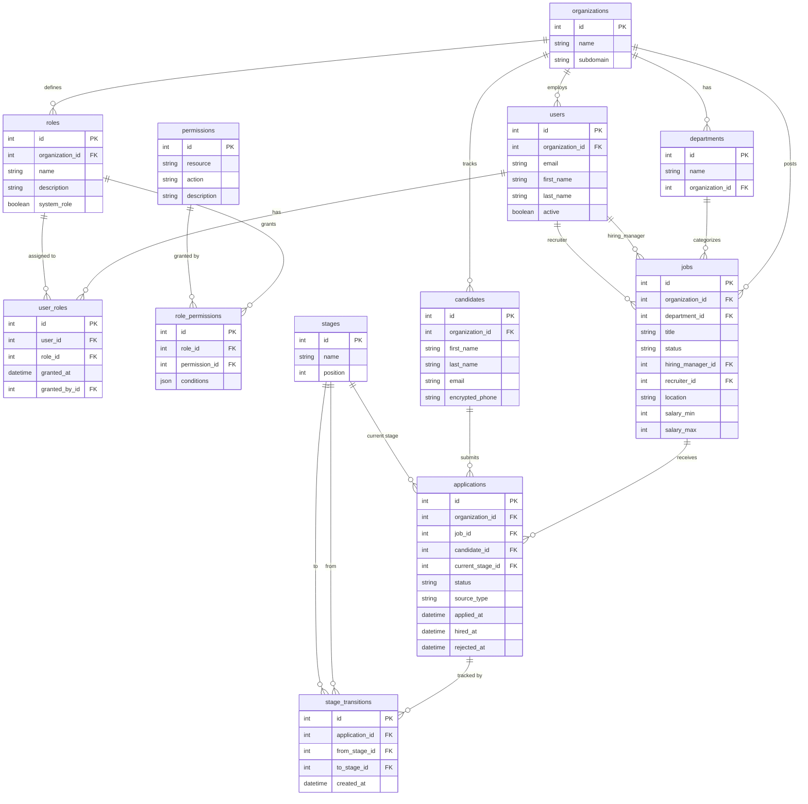

# Combined Legoria Entity-Relationship Diagram

## Mermaid ERD

## Two Domains, One Database

This diagram shows both domains together:

### RBAC Domain (left side)
- `users` → `user_roles` → `roles` → `role_permissions` → `permissions`
- Answers: "Who can do what?"

### Pipeline Domain (right side)
- `organizations` → `jobs` → `applications` ← `candidates`
- `applications` → `stages` → `stage_transitions`
- Answers: "Who applied where and how's it going?"

### The Bridge
- `users` connects both domains: they're RBAC subjects AND job team members (hiring manager, recruiter)
- `organizations` scopes everything — both RBAC and pipeline data

### Key Modeling Patterns
1. **Join table** (`user_roles`) — mostly just FKs, some audit columns
2. **Join entity** (`applications`) — FKs plus its own lifecycle, status, timestamps
3. **Two FKs to same table** — `jobs.hiring_manager_id` and `jobs.recruiter_id` both → `users`
4. **State machine** — `applications.status` tracks lifecycle
5. **Audit trail** — `stage_transitions` records every pipeline change
6. **Multi-tenancy** — `organization_id` on nearly every table
