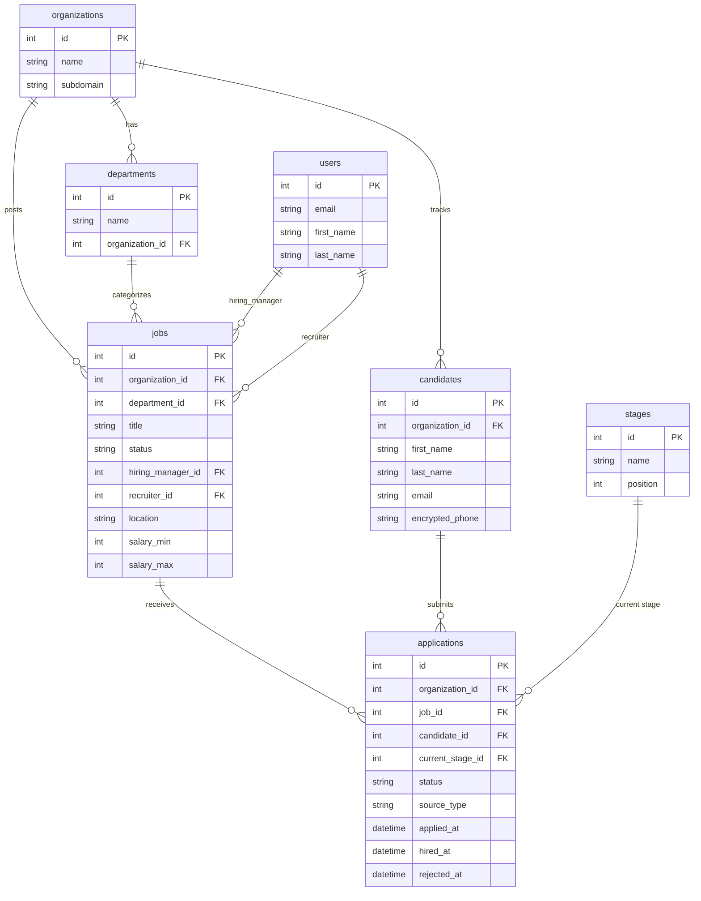

# Pipeline Entity-Relationship Diagram

## Mermaid ERD

## Reading the Diagram

- **Organizations** own everything (multi-tenant)
- **Jobs** belong to an org and a department, with two FK references to **Users** (hiring manager & recruiter)
- **Candidates** belong to an org
- **Applications** is the bridge entity between Jobs and Candidates — with its own lifecycle
- **Stages** define the pipeline positions (Applied → Screening → Interview → Offer → Hired)
- `applications.status` is a state machine: `new → screening → interviewing → offer → hired/rejected/withdrawn`
