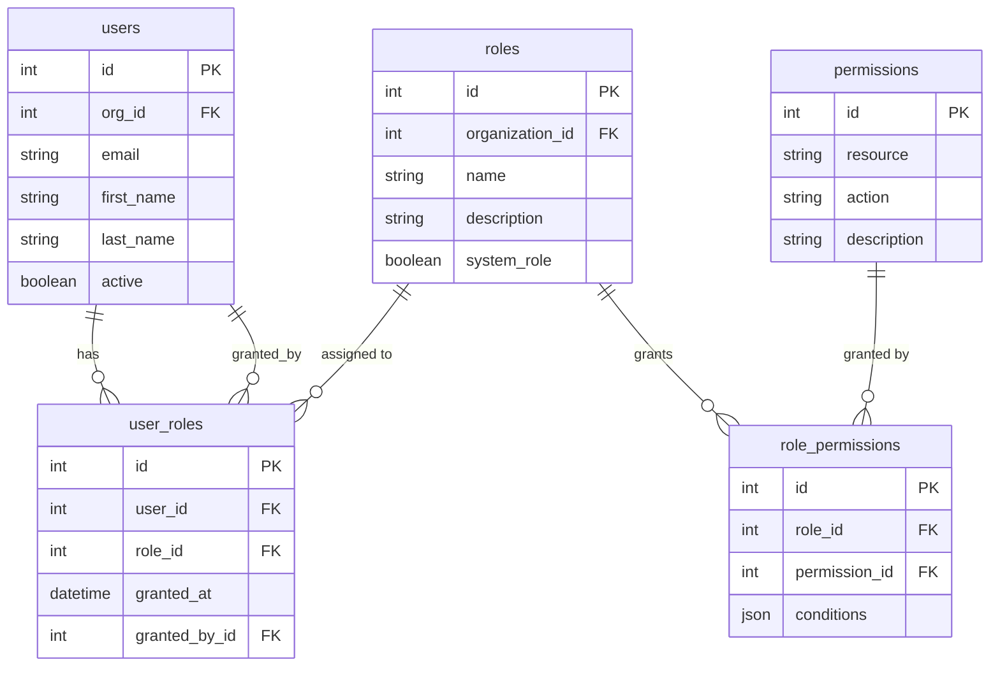

# RBAC Entity-Relationship Diagram

## Mermaid ERD

## Reading the Diagram

- **Users** connect to **Roles** through the **user_roles** join table
- **Roles** connect to **Permissions** through the **role_permissions** join table
- Two degrees of separation: User → Role → Permission
- `user_roles` has audit columns (`granted_at`, `granted_by_id`) — it's not just two FKs
- `permissions` uses a resource + action pattern (e.g., `candidates` + `read`)
- Everything scoped by `organization_id` for multi-tenancy
