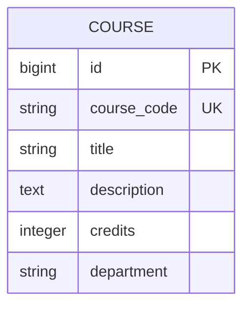

# Module 3: Build Instructions

This document walks you through adding the Course entity to the UCF Course Manager. You'll learn how to translate ER diagrams to Rails models and create your first ERD artifact.

## Prerequisites

- Completed Module 2
- PostgreSQL running

---

## Part 1: Design the ERD First

Before writing code, sketch the ER diagram:



### Questions to Answer

1. **What is the identity?** `id` (surrogate) + `course_code` (business key)
2. **What are the required attributes?** course_code, title
3. **What constraints exist?** course_code unique, credits 1-6
4. **What relationships?** None yet (Module 4)

---

## Part 2: Create the Migration

### Step 2.1: Generate Migration

```bash
cd course/modules/03-er-to-rails/app

bin/rails generate migration CreateCourses \
  course_code:string:uniq \
  title:string \
  description:text \
  credits:integer \
  department:string
```

### Step 2.2: Enhance the Migration

Edit `db/migrate/YYYYMMDDHHMMSS_create_courses.rb`:

```ruby
class CreateCourses < ActiveRecord::Migration[8.1]
  def change
    create_table :courses do |t|
      t.string :course_code, null: false
      t.string :title, null: false
      t.text :description
      t.integer :credits, default: 3
      t.string :department
      t.timestamps
    end

    add_index :courses, :course_code, unique: true
    add_index :courses, :department
  end
end
```

### Step 2.3: Run Migration

```bash
bin/rails db:migrate
```

---

## Part 3: Create the Model

Create `app/models/course.rb`:

```ruby
class Course < ApplicationRecord
  validates :course_code, presence: true,
                          uniqueness: { case_sensitive: false },
                          format: { with: /\A[A-Z]{3}\d{4}[A-Z]?\z/,
                                    message: "must be like 'COP3502'" }
  validates :title, presence: true
  validates :credits, numericality: { only_integer: true,
                                       greater_than: 0,
                                       less_than_or_equal_to: 6 }

  scope :by_department, ->(dept) { where(department: dept) }

  def display_name
    "#{course_code}: #{title}"
  end

  def credit_label
    credits == 1 ? "1 credit" : "#{credits} credits"
  end

  def level
    return nil unless course_code.present?
    level_digit = course_code[3]&.to_i
    case level_digit
    when 1, 2 then "Freshman/Sophomore"
    when 3 then "Junior"
    when 4 then "Senior"
    when 5, 6 then "Graduate"
    else "Unknown"
    end
  end
end
```

---

## Part 4: Create Controller

Create `app/controllers/courses_controller.rb`:

```ruby
class CoursesController < ApplicationController
  before_action :set_course, only: [:show, :edit, :update, :destroy]

  def index
    @courses = Course.all.order(:course_code)
    @courses = @courses.by_department(params[:department]) if params[:department].present?
  end

  def show; end
  def new; @course = Course.new; end
  def edit; end

  def create
    @course = Course.new(course_params)
    if @course.save
      redirect_to @course, notice: "Course created."
    else
      render :new, status: :unprocessable_entity
    end
  end

  def update
    if @course.update(course_params)
      redirect_to @course, notice: "Course updated."
    else
      render :edit, status: :unprocessable_entity
    end
  end

  def destroy
    @course.destroy
    redirect_to courses_path, notice: "Course deleted."
  end

  private

  def set_course
    @course = Course.find(params[:id])
  end

  def course_params
    params.require(:course).permit(:course_code, :title, :description, :credits, :department)
  end
end
```

---

## Part 5: Create Views

Create these files in `app/views/courses/`:

### index.html.erb
- Card-based layout showing course_code, title, credits
- Filter buttons by department
- New Course button

### show.html.erb
- Full course details
- Edit and Delete buttons

### _form.html.erb
- Form fields for all attributes
- Course code format hint

### new.html.erb / edit.html.erb
- Render the form partial

---

## Part 6: Update Routes and Navigation

### Routes

```ruby
# config/routes.rb
resources :students
resources :courses
root "students#index"
```

### Navigation

Update `app/views/layouts/application.html.erb` to add Courses link:

```erb
<li class="nav-item">
  <%= link_to "Courses", courses_path, class: "nav-link" %>
</li>
```

---

## Part 7: Create ERD Artifact

Create `artifacts/erd/domain-model.md`:

```markdown
# UCF Course Manager - ERD

## Module 3: Two Independent Entities

​```mermaid
erDiagram
    STUDENT {
        bigint id PK
        string student_number UK
        string first_name
        string last_name
        string email
        string major
    }

    COURSE {
        bigint id PK
        string course_code UK
        string title
        text description
        integer credits
        string department
    }
​```

Note: No relationship yet - that's Module 4!
```

---

## Part 8: Seed Data

Update `db/seeds.rb` to include courses:

```ruby
courses_data = [
  { course_code: "COP3502", title: "Computer Science I",
    description: "Introduction to programming...", credits: 3,
    department: "Computer Science" },
  # ... more courses
]

courses_data.each do |attrs|
  Course.find_or_create_by!(course_code: attrs[:course_code]) do |c|
    c.title = attrs[:title]
    c.description = attrs[:description]
    c.credits = attrs[:credits]
    c.department = attrs[:department]
  end
end
```

Run: `bin/rails db:seed`

---

## Running the Completed App

```bash
cd course/modules/03-er-to-rails/app

bundle install
bin/rails db:create db:migrate db:seed
bin/rails server
```

Open http://localhost:3000

- Click "Courses" in navigation
- Browse the course catalog
- Try filtering by department
- Create, edit, delete courses

---

## Verification Checklist

- [ ] Courses page shows all courses
- [ ] Can create new course with valid course_code
- [ ] Invalid course_code shows error (try "invalid")
- [ ] Can filter courses by department
- [ ] Navigation has both Students and Courses
- [ ] ERD artifact exists in `artifacts/erd/`

---

## Console Exploration

```ruby
# In bin/rails console

# Create a course
Course.create!(course_code: "COP4600", title: "Operating Systems", credits: 3)

# Query courses
Course.by_department("Computer Science")
Course.where("credits > ?", 3)

# Test validation
c = Course.new(course_code: "bad")
c.valid?  # false
c.errors.full_messages

# See generated SQL
Course.by_department("CS").to_sql
```

---

## Next Steps

Proceed to **Module 4: The Enrollment Aggregate** where you'll connect Students and Courses through an Enrollment relationship.
