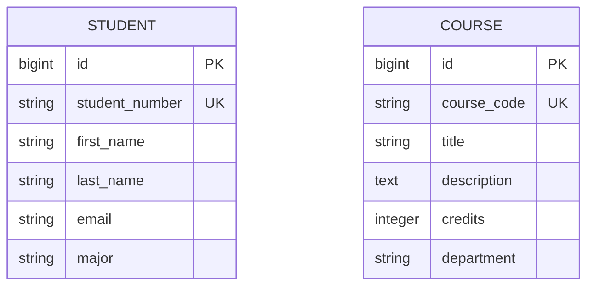
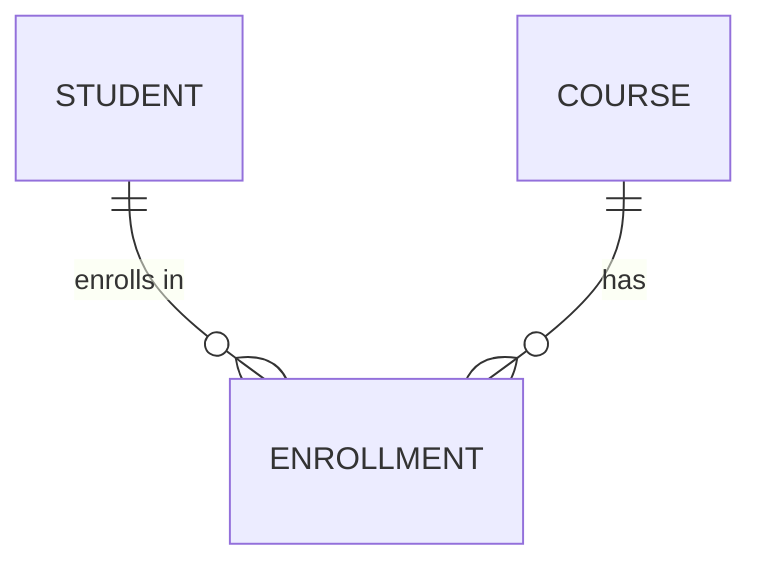

# Module 3: ER Modeling to Rails Models

In this module, we add the Course entity and learn how Entity-Relationship diagrams translate directly to Rails models. You'll create your first ERD artifact using Mermaid and understand how ER concepts map to database tables and Active Record.

## Learning Objectives

By the end of this module, you will be able to:

1. Create Entity-Relationship diagrams using Mermaid syntax
2. Translate ER entities to Rails models
3. Understand the relationship between ER attributes and table columns
4. Identify business keys vs surrogate keys
5. Apply consistent patterns across multiple entities

## DDD Concept: Multiple Entity Types

Our domain now has two **Entity Types**:

| Entity | Identity | Business Key | Purpose |
|--------|----------|--------------|---------|
| Student | `id` | `student_number` | Person enrolled at UCF |
| Course | `id` | `course_code` | Academic offering |

Each entity exists independently - they have their own lifecycle, their own identity, and their own rules. In Module 4, we'll connect them with the Enrollment relationship.

---

## ER Modeling Fundamentals

### What is an Entity-Relationship Diagram?

An ERD is a visual representation of your domain's data structure. It shows:
- **Entities**: Things in your domain (Student, Course)
- **Attributes**: Properties of entities (name, email, credits)
- **Relationships**: How entities connect (enrollment - coming in Module 4)

### Our Current ERD



Note: No line between Student and Course - they're independent (for now).

---

## Mapping ER to Rails

### Entity → Model Class

**ER Entity:**
```
COURSE {
    bigint id PK
    string course_code UK
    string title
    ...
}
```

**Rails Model:**
```ruby
class Course < ApplicationRecord
  validates :course_code, presence: true, uniqueness: true
  validates :title, presence: true
end
```

### Attribute → Table Column

| ER Notation | Rails Migration | PostgreSQL |
|-------------|-----------------|------------|
| `string name` | `t.string :name` | `VARCHAR(255)` |
| `text description` | `t.text :description` | `TEXT` |
| `integer credits` | `t.integer :credits` | `INTEGER` |
| `PK` (Primary Key) | Auto-generated `id` | `BIGSERIAL PRIMARY KEY` |
| `UK` (Unique Key) | `add_index :table, :col, unique: true` | `UNIQUE INDEX` |

### Java/C Bridge

**Java (JPA):**
```java
@Entity
@Table(name = "courses")
public class Course {
    @Id
    @GeneratedValue(strategy = GenerationType.IDENTITY)
    private Long id;

    @Column(unique = true, nullable = false)
    private String courseCode;

    @Column(nullable = false)
    private String title;

    private String description;
    private Integer credits;
    private String department;
}
```

**C (struct):**
```c
typedef struct {
    long id;              // Primary key
    char course_code[10]; // Unique business key
    char title[100];
    char description[500];
    int credits;
    char department[50];
} Course;
```

---

## Mermaid ERD Syntax

Mermaid lets you write diagrams as code - version-controllable and diff-able.

### Basic Syntax

```mermaid
erDiagram
    ENTITY_NAME {
        type attribute_name constraints "comment"
    }
```

### Common Types

| Type | Description |
|------|-------------|
| `string` | Variable-length text |
| `text` | Long text (descriptions) |
| `integer` | Whole numbers |
| `bigint` | Large integers (IDs) |
| `boolean` | True/false |
| `date` | Date only |
| `datetime` | Date and time |
| `timestamp` | Date/time with timezone |

### Constraints

| Symbol | Meaning |
|--------|---------|
| `PK` | Primary Key |
| `FK` | Foreign Key |
| `UK` | Unique Key |

### Relationships (Preview for Module 4)



- `||` = exactly one
- `o{` = zero or more
- `|{` = one or more

---

## The Course Model

### Validations

```ruby
class Course < ApplicationRecord
  validates :course_code, presence: true,
                          uniqueness: { case_sensitive: false },
                          format: { with: /\A[A-Z]{3}\d{4}[A-Z]?\z/ }
  validates :title, presence: true
  validates :credits, numericality: { only_integer: true,
                                       greater_than: 0,
                                       less_than_or_equal_to: 6 }
end
```

These validations encode domain rules:
- Course codes follow UCF format (COP3502, CDA3103C)
- Every course needs a title
- Credits must be reasonable (1-6)

### Scopes

```ruby
scope :by_department, ->(dept) { where(department: dept) }
scope :undergraduate, -> { where("course_code LIKE ?", "___3%") }
```

Scopes are reusable query fragments - like named queries in JPA.

---

## App State After This Module

- **Two independent entities**: Student and Course
- **11 sample courses** from UCF CS curriculum
- **Navigation** updated with Students and Courses links
- **First ERD artifact** in `artifacts/erd/domain-model.md`
- **Card-based course listing** with filtering by department

---

## Exercises

### Exercise 1: Add a New Entity

Add a `Department` entity:

1. Draw the ERD (department has code, name, building)
2. Generate migration: `bin/rails g migration CreateDepartments code:string name:string building:string`
3. Create the model with validations
4. Create controller and views
5. Update navigation

### Exercise 2: Mermaid Practice

Create an ERD for a library system with:
- Book (isbn, title, author, published_year)
- Member (card_number, name, email)
- (Don't create relationships yet)

### Exercise 3: Validation Exploration

In `bin/rails console`:
```ruby
# Try creating invalid courses
Course.create(title: "Test")  # Missing course_code
Course.create(course_code: "invalid", title: "Test")  # Bad format
Course.create(course_code: "COP3502", title: "Test", credits: 10)  # Credits too high

# Check the errors
c = Course.new(course_code: "bad")
c.valid?
c.errors.full_messages
```

---

## What's Next?

In **Module 4: The Enrollment Aggregate**, we'll:
- Connect Students and Courses with an Enrollment entity
- Learn about `has_many :through` associations
- Add business logic to the join model
- Introduce RSpec testing

---

## Glossary

| Term | Definition |
|------|------------|
| **Entity Type** | A category of things in your domain (Student, Course) |
| **Attribute** | A property of an entity (name, credits) |
| **Primary Key (PK)** | Unique identifier for each record |
| **Business Key** | Domain-meaningful unique identifier (student_number) |
| **Surrogate Key** | System-generated identifier (id) |
| **ERD** | Entity-Relationship Diagram |
| **Mermaid** | Text-based diagramming tool |

---

## Artifacts

This module introduces the `artifacts/` folder:

```
artifacts/
└── erd/
    └── domain-model.md    # Current ERD with Mermaid diagrams
```

These artifacts are version-controlled alongside your code. As the domain evolves, update the diagrams to reflect the current state.
