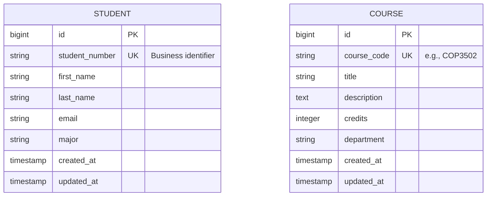
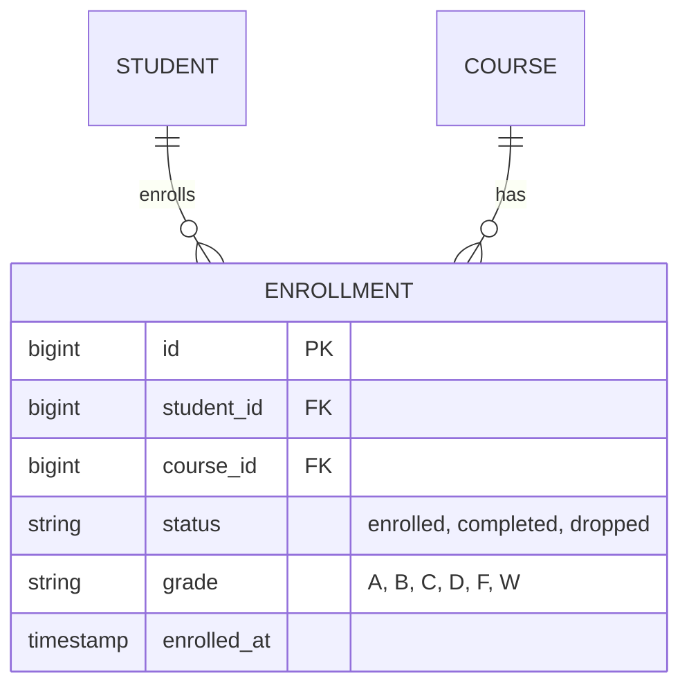

# UCF Course Manager - Entity Relationship Diagram

## Module 3: Two Independent Entities

This ERD represents the domain model after Module 3. We have two entity types that exist independently - they are not yet connected by a relationship.



## Entity Descriptions

### Student
- **Identity**: `id` (surrogate key) and `student_number` (business key)
- **Attributes**: Contact information and academic details
- **Constraints**:
  - `student_number` must be unique
  - `first_name` and `last_name` required

### Course
- **Identity**: `id` (surrogate key) and `course_code` (business key)
- **Attributes**: Course details and metadata
- **Constraints**:
  - `course_code` must be unique and follow UCF format (e.g., COP3502)
  - `title` required
  - `credits` between 1-6

## What's Missing (Coming in Module 4)

The current model has no relationship between Students and Courses. In the real domain:
- Students **enroll in** Courses
- Courses **have many** enrolled Students
- This many-to-many relationship requires an **Enrollment** entity



## Mapping to Rails

| ER Concept | Rails Implementation |
|------------|---------------------|
| Entity Type | Model class (`class Student < ApplicationRecord`) |
| Attribute | Table column + model attribute |
| Primary Key (PK) | `id` column (auto-generated) |
| Unique Key (UK) | `add_index :table, :column, unique: true` |
| Validation | `validates` in model |

## Database Schema

The `db/schema.rb` file shows the actual PostgreSQL implementation:

```ruby
create_table "students" do |t|
  t.string "student_number", null: false
  t.string "first_name"
  t.string "last_name"
  t.string "email"
  t.string "major"
  t.timestamps
  t.index ["student_number"], unique: true
end

create_table "courses" do |t|
  t.string "course_code", null: false
  t.string "title", null: false
  t.text "description"
  t.integer "credits", default: 3
  t.string "department"
  t.timestamps
  t.index ["course_code"], unique: true
end
```

## Notes for Java/C Developers

### Java (JPA) Equivalent

```java
@Entity
@Table(name = "students")
public class Student {
    @Id
    @GeneratedValue
    private Long id;

    @Column(unique = true, nullable = false)
    private String studentNumber;

    private String firstName;
    private String lastName;
    // ...
}
```

### C Struct Equivalent

```c
typedef struct {
    long id;
    char student_number[20];
    char first_name[50];
    char last_name[50];
    char email[100];
    char major[50];
} Student;
```

---

*This artifact is version-controlled alongside the code. As the domain model evolves, we update this diagram to reflect the current state.*
