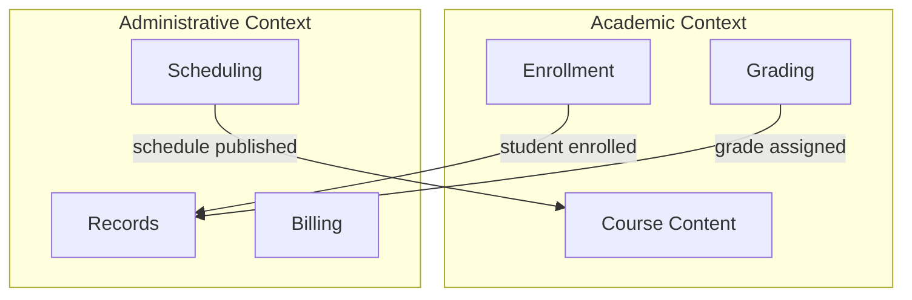

# Module 7: Bounded Contexts

In this module, we organize our growing application into bounded contexts - Academic and Administrative. We also introduce sprint planning as a development practice.

## Learning Objectives

By the end of this module, you will be able to:

1. Understand bounded contexts in DDD
2. Organize Rails code using namespaces/modules
3. Create context-specific views and navigation
4. Plan work using sprint methodology
5. Map contexts to understand integration points

## DDD Concept: Bounded Contexts

A **Bounded Context** is a boundary within which a domain model is defined and applicable. The same word can mean different things in different contexts:

| Term | Academic Context | Administrative Context |
|------|------------------|----------------------|
| "Course" | Learning content, curriculum | Scheduling unit, resource allocation |
| "Student" | Learner, grade recipient | Record, billing entity |
| "Grade" | Academic assessment | Transcript entry |

Each context has its own model, its own rules, its own language.

## Java/C Bridge: Packages and Modules

**Java packages:**
```java
// Academic context
package edu.ucf.academic;
public class Course { ... }

// Administrative context
package edu.ucf.admin;
public class Course { ... }  // Different class, same name!
```

**Rails namespaces:**
```ruby
# app/controllers/academic/courses_controller.rb
module Academic
  class CoursesController < ApplicationController
    # Academic-focused course management
  end
end

# app/controllers/admin/courses_controller.rb
module Admin
  class CoursesController < ApplicationController
    # Administrative course management
  end
end
```

## Key Artifacts Introduced

### Context Map (`artifacts/erd/context-map.md`)



### Sprint Planning (`artifacts/sprint/sprint-01-planning.md`)

```markdown
# Sprint 1: Bounded Context Setup

## Sprint Goal
Separate Academic and Administrative concerns into distinct namespaces

## User Stories
1. As an academic advisor, I need to see course content details
2. As a registrar, I need to manage course schedules
3. As a student, I need different views for learning vs. registration

## Tasks
- [ ] Create Academic namespace
- [ ] Create Admin namespace
- [ ] Split controllers by context
- [ ] Create context-specific navigation
```

## App State After This Module

- Academic namespace: courses, grades, learning
- Admin namespace: scheduling, records, registration
- Context-aware navigation
- Namespaced routes (`/academic/courses`, `/admin/courses`)
- Context map documentation

## Development Practice: Sprint Planning

Sprint workflow:
1. **Planning**: Define sprint goal, select user stories
2. **Daily work**: Pick tasks, implement, test
3. **Review**: Demo completed features
4. **Retrospective**: What went well? What to improve?

---

*To be expanded with full instructions and working app.*
