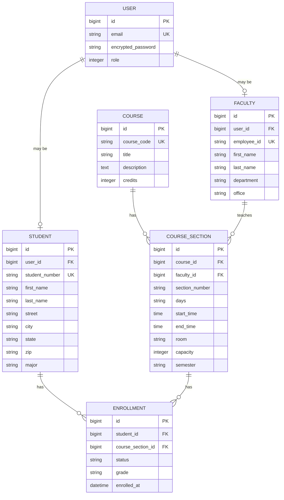

# Module 10: Capstone - Complete Application

In this final module, we polish the UCF Course Manager into a production-ready application. We integrate all previous modules, add final features, and prepare for deployment.

## Learning Objectives

By the end of this module, you will be able to:

1. Integrate all domain concepts into a cohesive application
2. Prepare a Rails application for production deployment
3. Create comprehensive seed data for demos
4. Write documentation for other developers
5. Conduct a sprint retrospective

## The Complete Domain Model



## Final Features

### Student Dashboard
- Current enrollments with schedule
- GPA calculation
- Upcoming deadlines
- Course search and registration

### Faculty Dashboard
- Teaching schedule
- Course rosters
- Grade entry
- Office hours management

### Admin Dashboard
- User management
- Course/Section management
- Enrollment reports
- System statistics

## Deployment Checklist

### Heroku Deployment

```bash
# Add Heroku remote
heroku create ucf-course-manager

# Set environment variables
heroku config:set RAILS_MASTER_KEY=$(cat config/master.key)

# Deploy
git push heroku main

# Run migrations
heroku run rails db:migrate

# Seed data
heroku run rails db:seed
```

### Production Considerations

- [ ] Environment variables for secrets
- [ ] Database backups configured
- [ ] Error tracking (Sentry/Rollbar)
- [ ] Performance monitoring
- [ ] SSL/HTTPS enabled
- [ ] Asset compilation
- [ ] Background jobs (if needed)

## Final Artifacts

### Complete ERD
`artifacts/erd/complete-domain-model.md`

### All Use Cases
- Enroll in Course
- Drop Course
- Assign Grade
- Create Course Section
- Register User
- Manage Faculty Assignment

### Sprint Retrospective
`artifacts/sprint/retrospective.md`

```markdown
# Course Retrospective

## What Went Well
- Progressive complexity worked
- Java/C bridges helped understanding
- Bootstrap provided consistent UI

## What Could Improve
- More time on testing
- Earlier introduction of services
- More real-world examples

## Action Items for Future
- Add API module
- Include mobile considerations
- Expand Fowler patterns coverage
```

## App State: Production Ready

- All features integrated and working
- Comprehensive test suite
- Seed data for demos
- README with setup instructions
- Deployed to Heroku (or ready to deploy)
- Documentation complete

## Course Completion

Congratulations! You've built a complete domain-driven Rails application:

1. **Module 1**: Rails foundations, Ruby basics
2. **Module 2**: Database persistence, migrations
3. **Module 3**: ER modeling, relationships
4. **Module 4**: Aggregates, testing, use cases
5. **Module 5**: Descriptors, refactoring
6. **Module 6**: Domain services
7. **Module 7**: Bounded contexts, sprint planning
8. **Module 8**: Party pattern, scheduling
9. **Module 9**: Authentication, authorization
10. **Module 10**: Integration, deployment

You now understand:
- How to translate domain concepts to code
- The relationship between ER models and Rails
- Professional development practices
- Full-stack web development with Rails

---

*The complete application demonstrates everything you've learned. Use it as a reference for future projects.*
