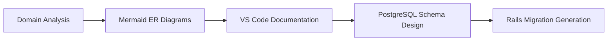
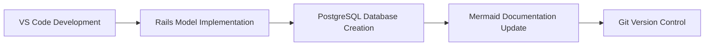
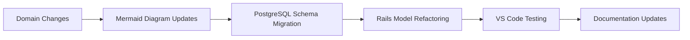

# Development Tools for Domain-Driven Design Course

This section provides comprehensive guides for the essential tools used throughout the DDD course. Each tool guide can be studied independently as advanced learning domains, providing deep expertise in modern software development practices.

## Tool Overview

The course utilizes three primary tools that work together to create a comprehensive development environment for Domain-Driven Design and Rails development:

### 🎨 [Mermaid: Diagram as Code](mermaid/)
**Purpose**: Visual domain modeling and documentation
**Learning Domain**: Diagram-driven development and visual communication

Mermaid enables you to create Entity-Relationship diagrams, flowcharts, and system architecture diagrams using text-based syntax. This approach ensures your domain models are version-controlled, reviewable, and maintainable alongside your code.

**Key Applications in DDD:**
- Entity-Relationship diagrams using Information Engineering notation
- Bounded context mapping and domain visualization
- Process flows for SDLC integration
- Database schema documentation
- System architecture representation

**Advanced Study Topics:**
- Custom themes and styling
- Programmatic diagram generation
- Integration with documentation platforms
- Automated diagram testing and validation

### 💻 [Visual Studio Code: IDE for DDD Development](vscode/)
**Purpose**: Integrated development environment with Rails and database support
**Learning Domain**: Modern IDE mastery and development workflow optimization

VS Code provides a powerful, extensible platform for Ruby on Rails development with excellent support for database management, version control, and collaborative development.

**Key Applications in DDD:**
- Ruby and Rails development with IntelliSense
- Database integration and query tools
- Git workflow and collaboration features
- Live Share for collaborative domain modeling
- Integrated testing and debugging

**Advanced Study Topics:**
- Custom extension development
- Workspace optimization for large projects
- Remote development and containers
- Advanced debugging techniques
- Automation and task integration

### 🗄️ [PostgreSQL: Advanced Database Management](postgresql/)
**Purpose**: Production-grade database system for domain data persistence
**Learning Domain**: Advanced database design and administration

PostgreSQL provides enterprise-level features that align perfectly with Domain-Driven Design principles, including advanced data types, constraints, and performance optimization capabilities.

**Key Applications in DDD:**
- Entity tables with Information Engineering principles
- JSON/JSONB for complex descriptors
- Custom data types for domain concepts
- Triggers and functions for domain rules
- Performance optimization and monitoring

**Advanced Study Topics:**
- Database administration and tuning
- Replication and high availability
- Advanced indexing strategies
- Custom extensions and functions
- Security and compliance

## Tool Integration Workflow

### 1. Domain Modeling Phase


### 2. Development Phase


### 3. Iteration and Refinement


## Getting Started with All Tools

### Quick Setup Checklist
- [ ] Install VS Code with recommended extensions
- [ ] Set up PostgreSQL database server
- [ ] Configure Mermaid preview in VS Code
- [ ] Create course workspace in VS Code
- [ ] Connect to PostgreSQL from VS Code
- [ ] Test Mermaid diagram rendering

### Integrated Development Environment
```json
// .vscode/settings.json - Unified configuration
{
    "mermaid.theme": "default",
    "postgresql.connections": [
        {
            "name": "Course Database",
            "driver": "PostgreSQL",
            "server": "localhost",
            "port": 5432,
            "database": "ucf_course_manager_development"
        }
    ],
    "ruby.intellisense": "rubyLocate",
    "files.associations": {
        "*.mmd": "mermaid",
        "*.mermaid": "mermaid"
    }
}
```

## Learning Paths

### Beginner Path (Course Prerequisites)
1. **VS Code Basics**: Installation, basic editing, extensions
2. **PostgreSQL Fundamentals**: Installation, basic SQL, database creation
3. **Mermaid Introduction**: Basic syntax, ER diagrams, preview

### Intermediate Path (Course Integration)
1. **VS Code Rails Development**: Ruby extensions, debugging, testing
2. **PostgreSQL for Rails**: Migrations, constraints, indexing
3. **Mermaid for Documentation**: Complex diagrams, integration with docs

### Advanced Path (Independent Study)
1. **VS Code Mastery**: Custom extensions, advanced workflows, remote development
2. **PostgreSQL Administration**: Performance tuning, replication, security
3. **Mermaid Automation**: Programmatic generation, custom themes, CI/CD integration

## Course Module Integration

### Module 1: Foundations
- **VS Code**: Basic setup and Rails project creation
- **PostgreSQL**: Database installation and initial schema
- **Mermaid**: First ER diagrams for Student-Course-Enrollment

### Module 2: ER Modeling with IE Semantics
- **Mermaid**: Advanced ER diagrams with composite descriptors
- **PostgreSQL**: Complex table structures and constraints
- **VS Code**: Rails model generation and validation

### Module 3: Bounded Contexts
- **Mermaid**: Context mapping diagrams
- **PostgreSQL**: Schema separation strategies
- **VS Code**: Multi-context Rails application structure

### Module 4: Entities and Descriptors
- **PostgreSQL**: Custom data types and JSON columns
- **VS Code**: Rails model implementation with descriptors
- **Mermaid**: Detailed entity modeling diagrams

### Module 5: Aggregates and Consistency
- **PostgreSQL**: Triggers and functions for domain rules
- **VS Code**: Service object implementation
- **Mermaid**: Aggregate boundary visualization

### Module 6: Repositories and Services
- **VS Code**: Advanced Rails patterns and testing
- **PostgreSQL**: Query optimization and performance
- **Mermaid**: Service interaction diagrams

### Module 7: Context Mapping
- **Mermaid**: Strategic design diagrams
- **PostgreSQL**: Cross-context data integration
- **VS Code**: Multi-application development

### Module 8: Fowler's Patterns
- **Mermaid**: Pattern implementation diagrams
- **PostgreSQL**: Advanced modeling techniques
- **VS Code**: Pattern-based code organization

### Module 9: DDD in SDLC
- **VS Code**: Full development workflow
- **PostgreSQL**: Production deployment considerations
- **Mermaid**: Process flow documentation

### Module 10: Capstone
- **All Tools**: Complete system implementation
- **Integration**: Tool workflow mastery
- **Documentation**: Comprehensive project documentation

## Best Practices for Tool Integration

### Version Control Strategy
```bash
# Include all tool configurations in Git
git add .vscode/settings.json
git add .vscode/tasks.json
git add docs/*.mermaid
git add db/schema.rb
git commit -m "feat: add integrated development environment setup"
```

### Documentation Standards
- Store Mermaid diagrams in `docs/diagrams/`
- Include PostgreSQL schema documentation
- Maintain VS Code workspace configuration
- Document tool-specific setup requirements

### Collaboration Guidelines
- Share VS Code workspace files
- Use Live Share for pair programming
- Version control database migrations
- Review Mermaid diagrams in pull requests

### Troubleshooting Common Issues
- **Tool Integration Problems**: Check extension compatibility
- **Database Connection Issues**: Verify PostgreSQL service status
- **Diagram Rendering Problems**: Update Mermaid extension
- **Performance Issues**: Optimize VS Code settings for large projects

## Additional Resources

### Official Documentation
- [Mermaid Documentation](https://mermaid-js.github.io/mermaid/)
- [VS Code Documentation](https://code.visualstudio.com/docs)
- [PostgreSQL Documentation](https://www.postgresql.org/docs/)

### Community Resources
- [Mermaid GitHub Repository](https://github.com/mermaid-js/mermaid)
- [VS Code Ruby Community](https://github.com/rubyide/vscode-ruby)
- [PostgreSQL Community](https://www.postgresql.org/community/)

### Course-Specific Resources
- [Course Examples Repository](../examples/)
- [Module Documentation](../modules/)
- [Assessment Guidelines](../assessments/)

---

*These tools form the foundation of modern Domain-Driven Design development. Mastering them individually and understanding their integration will significantly enhance your software development capabilities beyond this course.*