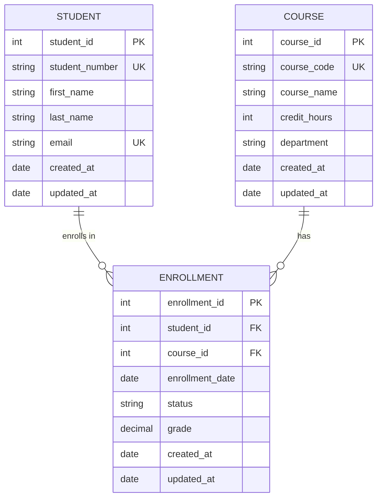
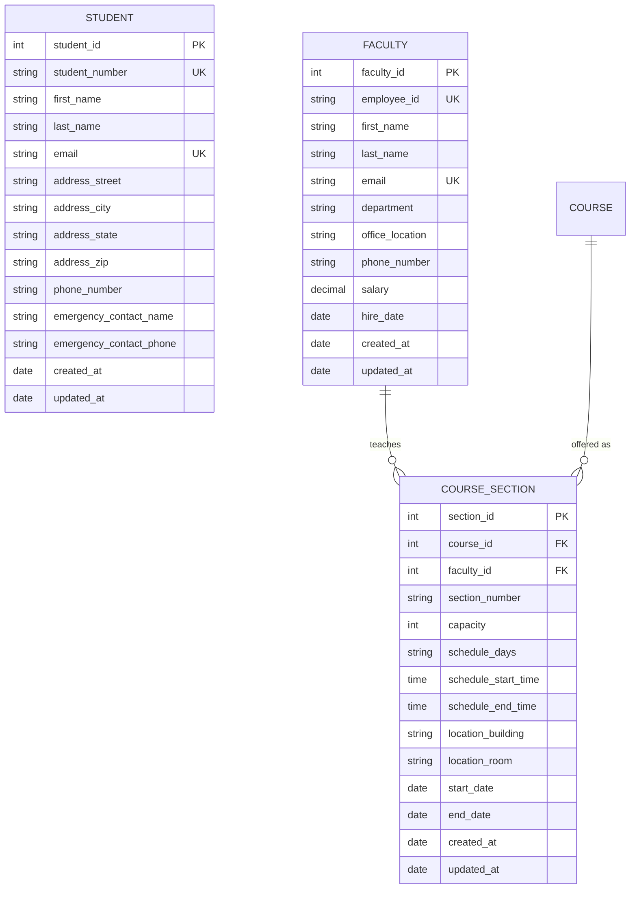
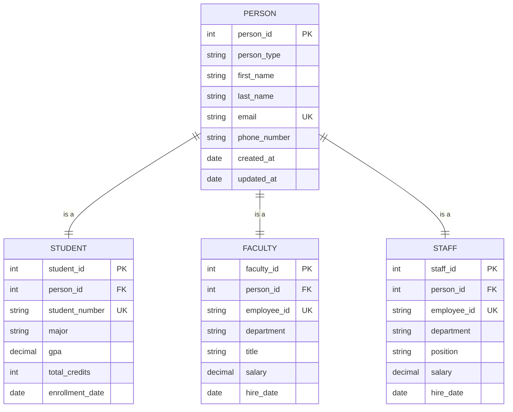
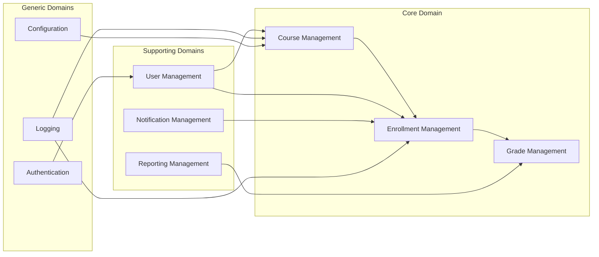
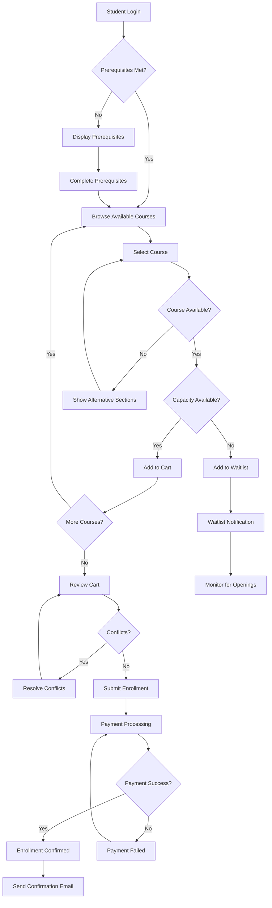
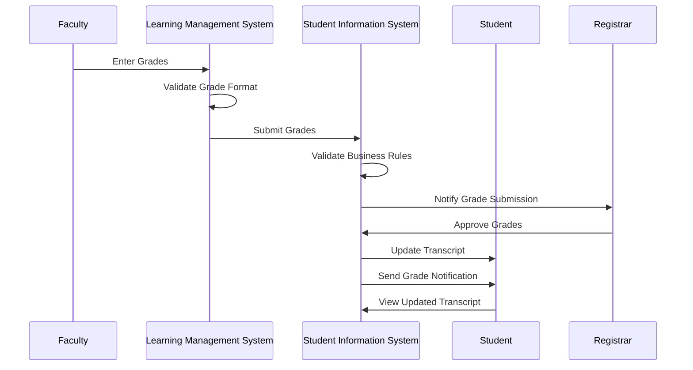
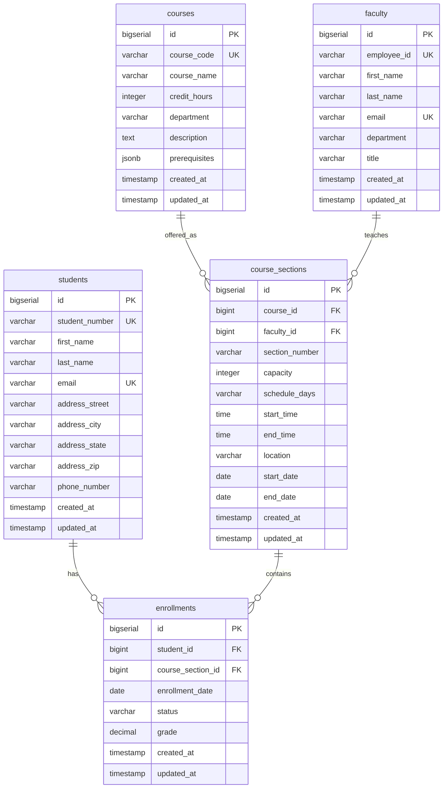
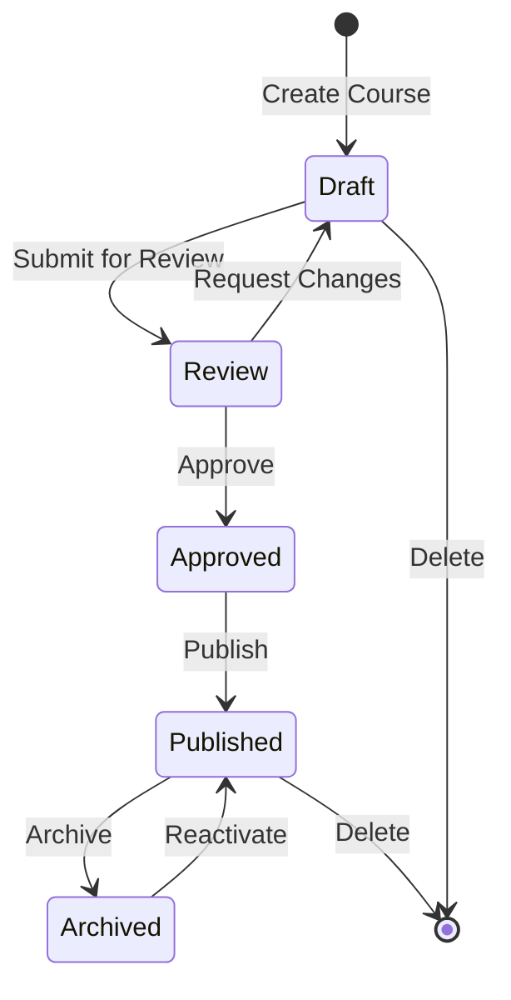

# Mermaid: Diagram as Code for Domain Modeling

Mermaid is a powerful diagramming and charting tool that uses text-based syntax to create visual diagrams. In the context of Domain-Driven Design and database modeling, Mermaid provides an excellent way to create Entity-Relationship diagrams, flowcharts, and other visual representations that can be version-controlled alongside your code.

## Why Mermaid for DDD and Database Design?

### Advantages
- **Version Control**: Diagrams are text-based and can be tracked in Git
- **Collaboration**: Easy to review and modify through pull requests
- **Integration**: Works seamlessly with GitHub, GitLab, and documentation platforms
- **Consistency**: Standardized syntax ensures uniform diagram appearance
- **Automation**: Can be generated programmatically from code or data
- **Accessibility**: Text-based format is screen-reader friendly

### Use Cases in DDD Course
- Entity-Relationship diagrams using IE notation
- Domain model visualization
- Bounded context mapping
- System architecture diagrams
- Process flows for SDLC integration
- Database schema visualization

## Installation and Setup

### Online Editor
- Visit [Mermaid Live Editor](https://mermaid.live/) for immediate use
- No installation required
- Export to PNG, SVG, or copy markdown

### VS Code Integration
```bash
# Install Mermaid Preview extension
code --install-extension bierner.markdown-mermaid
```

### Local Installation
```bash
# Install Mermaid CLI
npm install -g @mermaid-js/mermaid-cli

# Verify installation
mmdc --version
```

### GitHub Integration
Mermaid diagrams render automatically in GitHub markdown files.

## Entity-Relationship Diagrams for DDD

### Basic ER Diagram Syntax


### Advanced ER Features

#### Composite Descriptors


#### Inheritance and Subtypes


## Bounded Context Diagrams

### Context Mapping
```mermaid
graph TB
    subgraph "Academic Context"
        AC[Academic Catalog]
        CS[Course Scheduling]
        EN[Enrollment Management]
        GR[Grade Recording]
    end
    
    subgraph "Student Services Context"
        SR[Student Registration]
        AD[Academic Advising]
        TR[Transcript Management]
        FA[Financial Aid]
    end
    
    subgraph "Administrative Context"
        HR[Human Resources]
        FN[Finance]
        FC[Facilities]
        IT[IT Services]
    end
    
    subgraph "External Systems"
        SIS[Student Information System]
        LMS[Learning Management System]
        PAY[Payment Gateway]
        EMAIL[Email Service]
    end
    
    AC --> SR : "Course Offerings"
    EN --> TR : "Enrollment Data"
    GR --> TR : "Grade Data"
    SR --> FA : "Enrollment Status"
    HR --> AC : "Faculty Assignments"
    
    AC -.-> SIS : "Sync Course Data"
    EN -.-> LMS : "Roster Updates"
    FA -.-> PAY : "Payment Processing"
    SR -.-> EMAIL : "Notifications"
```

### Domain Model Overview


## Process Flow Diagrams

### Student Enrollment Process


### Grade Processing Workflow


## Database Schema Visualization

### Physical Database Design


## Advanced Mermaid Features

### State Diagrams for Entity Lifecycle


### Class Diagrams for Rails Models
```mermaid
classDiagram
    class Student {
        +String student_number
        +String first_name
        +String last_name
        +String email
        +Address address
        +enrollments() Enrollment[]
        +courses() Course[]
        +gpa() Decimal
        +full_name() String
        +active_enrollments() Enrollment[]
    }
    
    class Course {
        +String course_code
        +String course_name
        +Integer credit_hours
        +String department
        +course_sections() CourseSection[]
        +students() Student[]
        +enrollment_count() Integer
        +full_title() String
    }
    
    class Enrollment {
        +Date enrollment_date
        +String status
        +Decimal grade
        +student() Student
        +course_section() CourseSection
        +completed?() Boolean
        +letter_grade() String
    }
    
    class CourseSection {
        +String section_number
        +Integer capacity
        +Schedule schedule
        +Location location
        +course() Course
        +faculty() Faculty
        +enrollments() Enrollment[]
        +available_spots() Integer
    }
    
    Student ||--o{ Enrollment : enrolls
    CourseSection ||--o{ Enrollment : contains
    Course ||--o{ CourseSection : offered_as
    Faculty ||--o{ CourseSection : teaches
```

## Integration with Course Modules

### Module 1: Foundations
- Basic ER diagrams for Student-Course-Enrollment
- Simple relationship visualization

### Module 2: IE Semantics
- Composite descriptor representation
- Normalization visualization

### Module 3: Bounded Contexts
- Context mapping diagrams
- Domain boundaries

### Module 4: Entities and Descriptors
- Detailed entity modeling
- Descriptor composition

### Module 5: Aggregates
- Aggregate boundary visualization
- Consistency boundary mapping

### Module 6: Repositories and Services
- Service interaction diagrams
- Data flow visualization

### Module 7: Context Mapping
- Strategic design diagrams
- Integration patterns

### Module 8: Fowler Patterns
- Pattern implementation diagrams
- Analysis pattern visualization

### Module 9: SDLC Integration
- Process flow diagrams
- Workflow visualization

### Module 10: Capstone
- Complete system architecture
- Comprehensive domain model

## Best Practices

### Diagram Organization
1. **Start Simple**: Begin with basic entities and relationships
2. **Iterate**: Add complexity gradually
3. **Focus**: One concept per diagram
4. **Consistency**: Use standard notation throughout

### Naming Conventions
- Use IE terminology (Entity Types, Descriptors)
- Follow database naming conventions
- Be consistent with attribute names
- Use meaningful relationship labels

### Version Control
- Include diagrams in Git repository
- Use meaningful commit messages for diagram changes
- Review diagrams in pull requests
- Tag major diagram versions

### Documentation Integration
- Embed diagrams in module documentation
- Link diagrams to related code
- Provide context and explanations
- Keep diagrams up-to-date with code changes

## Learning Resources

### Official Documentation
- [Mermaid Documentation](https://mermaid-js.github.io/mermaid/)
- [Entity Relationship Diagrams](https://mermaid-js.github.io/mermaid/#/entityRelationshipDiagram)
- [Flowcharts](https://mermaid-js.github.io/mermaid/#/flowchart)

### Tutorials and Examples
- [Mermaid Tutorial](https://mermaid-js.github.io/mermaid/#/Tutorials)
- [GitHub Mermaid Support](https://github.blog/2022-02-14-include-diagrams-markdown-files-mermaid/)
- [VS Code Mermaid Extension](https://marketplace.visualstudio.com/items?itemName=bierner.markdown-mermaid)

### Advanced Topics
- Custom themes and styling
- Programmatic diagram generation
- Integration with documentation platforms
- Automated diagram testing and validation

---

*Mermaid provides a powerful way to create and maintain visual representations of your domain models that evolve alongside your code. Master this tool to enhance your domain modeling and communication skills.*