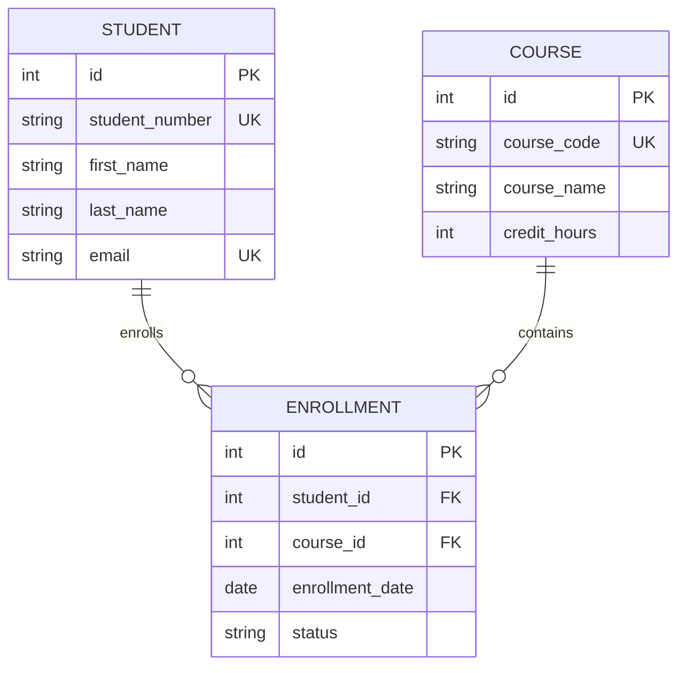

# Visual Studio Code: IDE Setup for DDD and Rails Development

Visual Studio Code (VS Code) is a powerful, extensible code editor that provides excellent support for Ruby on Rails development, database management, and domain modeling. This guide covers the essential setup, extensions, and workflows for the DDD course.

## Why VS Code for DDD and Rails Development?

### Advantages
- **Free and Open Source**: No licensing costs
- **Extensible**: Rich ecosystem of extensions
- **Integrated Terminal**: Built-in command line access
- **Git Integration**: Native version control support
- **IntelliSense**: Smart code completion and navigation
- **Debugging**: Built-in debugging capabilities
- **Multi-Platform**: Works on Windows, macOS, and Linux

### Course-Specific Benefits
- Ruby and Rails syntax highlighting and IntelliSense
- Database integration and query tools
- Mermaid diagram preview and editing
- Markdown support for documentation
- Git workflow integration
- Live Share for collaborative domain modeling

## Installation and Initial Setup

### Download and Install
1. Visit [code.visualstudio.com](https://code.visualstudio.com/)
2. Download for your operating system
3. Run the installer with default settings
4. Launch VS Code

### Initial Configuration
```json
// settings.json - Access via Cmd/Ctrl + ,
{
    "editor.tabSize": 2,
    "editor.insertSpaces": true,
    "editor.detectIndentation": true,
    "editor.wordWrap": "on",
    "editor.minimap.enabled": true,
    "editor.rulers": [80, 120],
    "files.trimTrailingWhitespace": true,
    "files.insertFinalNewline": true,
    "workbench.colorTheme": "Default Dark+",
    "terminal.integrated.shell.osx": "/bin/zsh",
    "git.enableSmartCommit": true,
    "git.confirmSync": false
}
```

## Essential Extensions for DDD Course

### Core Ruby and Rails Extensions

#### 1. Ruby LSP
```bash
# Install via VS Code Extensions
# Extension ID: Shopify.ruby-lsp
```
**Features:**
- Syntax highlighting and formatting
- IntelliSense and code completion
- Go to definition and references
- Error detection and linting
- Code folding and outline

**Configuration:**
```json
{
    "rubyLsp.enabledFeatures": {
        "codeActions": true,
        "diagnostics": true,
        "documentHighlights": true,
        "documentLink": true,
        "documentSymbols": true,
        "foldingRanges": true,
        "formatting": true,
        "hover": true,
        "inlayHint": true,
        "onTypeFormatting": true,
        "selectionRanges": true,
        "semanticHighlighting": true,
        "completion": true
    }
}
```

#### 2. Rails
```bash
# Extension ID: bung87.rails
```
**Features:**
- Rails file navigation
- Partial and layout recognition
- Route helpers
- Model associations
- Migration helpers

#### 3. Ruby Solargraph
```bash
# Extension ID: castwide.solargraph
# Install Solargraph gem first
gem install solargraph
```
**Features:**
- Advanced IntelliSense
- Type checking
- Code completion
- Documentation on hover

### Database Extensions

#### 4. SQLite Viewer
```bash
# Extension ID: qwtel.sqlite-viewer
```
**Features:**
- View SQLite databases directly in VS Code
- Execute queries
- Browse table structure
- Export data

#### 5. PostgreSQL
```bash
# Extension ID: ms-ossdata.vscode-postgresql
```
**Features:**
- Connect to PostgreSQL databases
- Execute SQL queries
- Browse database schema
- Data visualization

**Configuration:**
```json
{
    "postgresql.connections": [
        {
            "host": "localhost",
            "user": "your_username",
            "password": "your_password",
            "port": 5432,
            "database": "ucf_course_manager_development"
        }
    ]
}
```

#### 6. SQL Tools
```bash
# Extension ID: mtxr.sqltools
# Extension ID: mtxr.sqltools-driver-pg (for PostgreSQL)
```
**Features:**
- Multi-database support
- Query execution and formatting
- Schema exploration
- Connection management

### Documentation and Diagramming

#### 7. Markdown All in One
```bash
# Extension ID: yzhang.markdown-all-in-one
```
**Features:**
- Live preview
- Table of contents generation
- Math support
- Export to HTML/PDF

#### 8. Mermaid Preview
```bash
# Extension ID: bierner.markdown-mermaid
```
**Features:**
- Live Mermaid diagram preview
- Syntax highlighting
- Export diagrams
- Integration with markdown

#### 9. Draw.io Integration
```bash
# Extension ID: hediet.vscode-drawio
```
**Features:**
- Create and edit diagrams
- Export to various formats
- Version control integration
- Collaborative editing

### Git and Collaboration

#### 10. GitLens
```bash
# Extension ID: eamodio.gitlens
```
**Features:**
- Git blame annotations
- Repository insights
- File history
- Branch comparison

#### 11. Live Share
```bash
# Extension ID: ms-vsliveshare.vsliveshare
```
**Features:**
- Real-time collaboration
- Shared debugging
- Terminal sharing
- Voice chat integration

### Code Quality and Testing

#### 12. Ruby Test Explorer
```bash
# Extension ID: connorshea.vscode-ruby-test-adapter
```
**Features:**
- Run individual tests
- Test discovery
- Test results visualization
- Debug test failures

#### 13. RuboCop
```bash
# Extension ID: misogi.ruby-rubocop
# Install RuboCop gem first
gem install rubocop
```
**Features:**
- Code style checking
- Automatic formatting
- Custom rule configuration
- Integration with Ruby LSP

### Productivity Extensions

#### 14. Auto Rename Tag
```bash
# Extension ID: formulahendry.auto-rename-tag
```

#### 15. Bracket Pair Colorizer
```bash
# Extension ID: coenraads.bracket-pair-colorizer-2
```

#### 16. Path Intellisense
```bash
# Extension ID: christian-kohler.path-intellisense
```

#### 17. TODO Highlight
```bash
# Extension ID: wayou.vscode-todo-highlight
```

## Workspace Configuration for DDD Course

### Project Structure Setup
```json
// .vscode/settings.json (project-specific)
{
    "files.associations": {
        "*.rb": "ruby",
        "*.erb": "erb",
        "Gemfile": "ruby",
        "Rakefile": "ruby",
        "*.rake": "ruby"
    },
    "emmet.includeLanguages": {
        "erb": "html"
    },
    "ruby.intellisense": "rubyLocate",
    "ruby.codeCompletion": "rcodetools",
    "ruby.format": "rubocop",
    "sqltools.connections": [
        {
            "name": "UCF Course Manager Dev",
            "driver": "PostgreSQL",
            "previewLimit": 50,
            "server": "localhost",
            "port": 5432,
            "database": "ucf_course_manager_development",
            "username": "your_username",
            "askForPassword": true
        }
    ]
}
```

### Tasks Configuration
```json
// .vscode/tasks.json
{
    "version": "2.0.0",
    "tasks": [
        {
            "label": "Rails Server",
            "type": "shell",
            "command": "rails",
            "args": ["server"],
            "group": "build",
            "presentation": {
                "echo": true,
                "reveal": "always",
                "focus": false,
                "panel": "new"
            },
            "problemMatcher": []
        },
        {
            "label": "Rails Console",
            "type": "shell",
            "command": "rails",
            "args": ["console"],
            "group": "build",
            "presentation": {
                "echo": true,
                "reveal": "always",
                "focus": true,
                "panel": "new"
            }
        },
        {
            "label": "Run Tests",
            "type": "shell",
            "command": "bundle",
            "args": ["exec", "rspec"],
            "group": "test",
            "presentation": {
                "echo": true,
                "reveal": "always",
                "focus": false,
                "panel": "shared"
            }
        },
        {
            "label": "Database Migrate",
            "type": "shell",
            "command": "rails",
            "args": ["db:migrate"],
            "group": "build"
        },
        {
            "label": "Database Seed",
            "type": "shell",
            "command": "rails",
            "args": ["db:seed"],
            "group": "build"
        }
    ]
}
```

### Launch Configuration for Debugging
```json
// .vscode/launch.json
{
    "version": "0.2.0",
    "configurations": [
        {
            "name": "Rails Server",
            "type": "Ruby",
            "request": "launch",
            "program": "${workspaceRoot}/bin/rails",
            "args": ["server"],
            "env": {
                "RAILS_ENV": "development"
            }
        },
        {
            "name": "RSpec - Current File",
            "type": "Ruby",
            "request": "launch",
            "program": "${workspaceRoot}/bin/rspec",
            "args": ["${file}"],
            "env": {
                "RAILS_ENV": "test"
            }
        }
    ]
}
```

## Workflow Integration

### Domain Modeling Workflow

#### 1. Create ER Diagrams with Mermaid
```markdown
<!-- In module documentation -->

```

#### 2. Generate Rails Models
```ruby
# Use VS Code snippets for quick model generation
class Student < ApplicationRecord
  validates :student_number, presence: true, uniqueness: true
  validates :first_name, :last_name, :email, presence: true
  validates :email, uniqueness: true, format: { with: URI::MailTo::EMAIL_REGEXP }
  
  has_many :enrollments, dependent: :destroy
  has_many :courses, through: :enrollments
  
  def full_name
    "#{first_name} #{last_name}"
  end
end
```

#### 3. Create Migrations
```ruby
# Use Rails extension for migration templates
class CreateStudents < ActiveRecord::Migration[7.0]
  def change
    create_table :students do |t|
      t.string :student_number, null: false
      t.string :first_name, null: false
      t.string :last_name, null: false
      t.string :email, null: false
      
      t.timestamps
    end
    
    add_index :students, :student_number, unique: true
    add_index :students, :email, unique: true
  end
end
```

### Database Development Workflow

#### 1. Schema Exploration
- Use PostgreSQL extension to browse database structure
- Execute queries directly in VS Code
- View table relationships and constraints

#### 2. Query Development
```sql
-- Use SQL Tools for query development
SELECT s.first_name, s.last_name, c.course_name, e.grade
FROM students s
JOIN enrollments e ON s.id = e.student_id
JOIN courses c ON c.id = e.course_id
WHERE e.status = 'completed'
ORDER BY s.last_name, s.first_name;
```

#### 3. Data Visualization
- Use SQLite Viewer for development database
- PostgreSQL extension for production-like data
- Export results for analysis

### Testing Workflow

#### 1. Write Tests with IntelliSense
```ruby
# RSpec with full code completion
RSpec.describe Student, type: :model do
  describe 'validations' do
    it { should validate_presence_of(:student_number) }
    it { should validate_uniqueness_of(:student_number) }
    it { should validate_presence_of(:email) }
    it { should validate_uniqueness_of(:email) }
  end
  
  describe 'associations' do
    it { should have_many(:enrollments).dependent(:destroy) }
    it { should have_many(:courses).through(:enrollments) }
  end
  
  describe '#full_name' do
    let(:student) { build(:student, first_name: 'John', last_name: 'Doe') }
    
    it 'returns the full name' do
      expect(student.full_name).to eq('John Doe')
    end
  end
end
```

#### 2. Run Tests with Test Explorer
- View all tests in sidebar
- Run individual tests or suites
- Debug failing tests
- View test coverage

### Git Workflow Integration

#### 1. Visual Git Operations
- Stage changes with GitLens
- View file history and blame
- Create and merge branches
- Resolve conflicts with built-in tools

#### 2. Commit Best Practices
```bash
# Use VS Code's Git integration for structured commits
git commit -m "feat(student): add composite descriptor for address

- Add address_street, address_city, address_state, address_zip fields
- Implement address composite descriptor method
- Update migration with proper constraints
- Add validation for address components

Closes #123"
```

## Custom Snippets for DDD Development

### Ruby Model Snippets
```json
// .vscode/ruby.json
{
    "Rails Model with Validations": {
        "prefix": "model",
        "body": [
            "class ${1:ModelName} < ApplicationRecord",
            "  # Validations",
            "  validates :${2:attribute}, presence: true",
            "  ",
            "  # Associations",
            "  ${3:# belongs_to :association}",
            "  ",
            "  # Scopes",
            "  ${4:# scope :active, -> { where(active: true) }}",
            "  ",
            "  # Instance methods",
            "  def ${5:method_name}",
            "    ${6:# implementation}",
            "  end",
            "  ",
            "  private",
            "  ",
            "  def ${7:private_method}",
            "    ${8:# implementation}",
            "  end",
            "end"
        ],
        "description": "Create a Rails model with common structure"
    },
    "Composite Descriptor": {
        "prefix": "descriptor",
        "body": [
            "def ${1:descriptor_name}",
            "  \"#{${2:attribute1}}, #{${3:attribute2}}\"",
            "end",
            "",
            "def ${1:descriptor_name}=(value)",
            "  parts = value.split(', ')",
            "  self.${2:attribute1} = parts[0]",
            "  self.${3:attribute2} = parts[1]",
            "end"
        ],
        "description": "Create a composite descriptor method"
    }
}
```

### Migration Snippets
```json
{
    "Create Table Migration": {
        "prefix": "migration",
        "body": [
            "class Create${1:TableName} < ActiveRecord::Migration[7.0]",
            "  def change",
            "    create_table :${2:table_name} do |t|",
            "      t.${3:string} :${4:attribute_name}, null: false",
            "      ",
            "      t.timestamps",
            "    end",
            "    ",
            "    add_index :${2:table_name}, :${4:attribute_name}, unique: true",
            "  end",
            "end"
        ],
        "description": "Create a Rails migration"
    }
}
```

## Debugging and Troubleshooting

### Common Issues and Solutions

#### Ruby LSP Not Working
1. Ensure Ruby is properly installed and in PATH
2. Install required gems: `gem install ruby-lsp`
3. Restart VS Code
4. Check Ruby LSP output panel for errors

#### Database Connection Issues
1. Verify PostgreSQL is running
2. Check connection settings in sqltools.connections
3. Ensure database exists and user has permissions
4. Test connection using built-in connection tester

#### Git Integration Problems
1. Ensure Git is installed and in PATH
2. Configure Git user name and email
3. Check GitLens settings for repository detection
4. Restart VS Code if Git status not updating

### Performance Optimization

#### Large Project Performance
```json
{
    "files.watcherExclude": {
        "**/node_modules/**": true,
        "**/tmp/**": true,
        "**/log/**": true,
        "**/coverage/**": true
    },
    "search.exclude": {
        "**/node_modules": true,
        "**/tmp": true,
        "**/log": true,
        "**/coverage": true
    }
}
```

#### Memory Usage
- Disable unused extensions
- Limit file watchers
- Use workspace-specific settings
- Close unused editor tabs

## Advanced Features

### Multi-Root Workspaces
```json
// course.code-workspace
{
    "folders": [
        {
            "name": "Course Materials",
            "path": "./course"
        },
        {
            "name": "UCF Course Manager",
            "path": "./course/examples/ucf-course-manager"
        },
        {
            "name": "Archived Java",
            "path": "./archived"
        }
    ],
    "settings": {
        "files.exclude": {
            "**/node_modules": true,
            "**/tmp": true
        }
    }
}
```

### Remote Development
- Use Remote-SSH for server development
- Remote-Containers for consistent environments
- GitHub Codespaces for cloud development
- Live Share for collaborative sessions

### Integration with External Tools
- Terminal integration for Rails commands
- Task runner for automated workflows
- Problem matchers for error detection
- Output channels for tool integration

## Learning Resources

### Official Documentation
- [VS Code Documentation](https://code.visualstudio.com/docs)
- [Ruby Extension Guide](https://marketplace.visualstudio.com/items?itemName=Shopify.ruby-lsp)
- [Rails Development Setup](https://code.visualstudio.com/docs/languages/ruby)

### Video Tutorials
- VS Code Ruby Development Setup
- Rails Debugging in VS Code
- Git Workflow with VS Code
- Database Development with VS Code

### Community Resources
- [VS Code Ruby Community](https://github.com/rubyide/vscode-ruby)
- [Rails VS Code Tips](https://gorails.com/episodes/vscode-ruby-rails-setup)
- [Ruby LSP Documentation](https://shopify.github.io/ruby-lsp/)

---

*VS Code provides a comprehensive development environment for Domain-Driven Design and Rails development. Master these tools and workflows to enhance your productivity and code quality throughout the course.*